name: inverse
layout: true
class: center, middle, inverse
---


# Procedural Generation and Simulation

### Prof. Dr. Lena Gieseke | l.gieseke@filmuniversitaet.de  

#### Film University Babelsberg KONRAD WOLF


---
layout: false

## Today

* Recap

--
* Tilings

--
* Islamic Art

???
.task[COMMENT:]  

* This chapter aims to give insights about tilings and geometric designs. Islamic art is one of, if not the most prominent application of such design goals. These specific design goals, tilings and geometry, are the driving factor for my selection of topics in this chapter. Other cultures and religions also include patterns - but less prominently than the Islamic culture. That is why I haven't included any of the other world religions. 

--
* Sacred Geometry

???
.task[COMMENT:]  

* Also, it is a questionable approach that I discuss Islamic designs side by side with the more esoteric topic of sacred geometry. I mean no offense - once again, this collection is made based on visuals and not meanings! 

--
* Homework


---

## Today

.center[] 

---
template: inverse

### Chapter 04
#  Function Design

---
## Function Design

???
.task[COMMENT:]  

* Which idea do we follow here?

--
.center[]    


--

> The idea is to modify, shape and to combine different functions. 

---
## Function Design

.center[]  

???
.task[COMMENT:]  

* What is demonstrated here?

--

As if we project the 3D plot onto a 2D plane.


---
## Function Design


.center[]  

???
.task[COMMENT:]  

* What is demonstrated here?

---
.header[Transitions]

## Interpolation Functions


???
.task[COMMENT:]  

* What is an interpolation function?

--


.center[]  
[[paulbourke]](http://paulbourke.net/miscellaneous/interpolation/)


???
.task[COMMENT:]  

* For example, in 3D software such as Houdini, there are several interpolations functions to chose from. Here, some comparisons:
* These different functions lead to different visual designs, depending on the context, e.g. for interpolating between colors for an image or positions for an animation. From left to right, Nearest Neighbor, Bilinear, Lagrange Bicubic interpolation (only interpolates values, not slopes), Hermite Bicubic interpolation


---
.header[Transitions]

## Interpolation Functions

.center[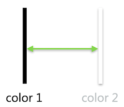]

---
.header[Transitions]

## Interpolation Functions

.center[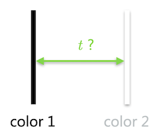]

--

*t* is often a coordinate within the 2D space that we are working with.


---
.header[Transitions]

## Linear Interpolation

.center[]  

--
  
* `a = 10, b = 2, t = 0,2` (left to right)
* `interpolated value = 10 * 0,8 + 2 * 0,2 = 8,4`

--

Linear and bilinear interpolation is usually called `lerp()`, e.g. in [Unreal](https://docs.unrealengine.com/5.1/en-US/BlueprintAPI/Math/Float/Lerp/), in [p5](https://p5js.org/reference/#/p5.Vector/lerp) or in [vex](http://www.sidefx.com/docs/houdini/vex/functions/lerp.html) or [mix](https://www.khronos.org/registry/OpenGL-Refpages/gl4/html/mix.xhtml) in glsl.


???
.task[COMMENT:]  

* https://www.youtube.com/@BenCloward/videos
* Number 6

---
.header[Transitions]

## Interpolation Functions

.center[]  
[[demofox]](https://blog.demofox.org/2015/08/15/resizing-images-with-bicubic-interpolation/)  


---
.header[Transitions]

## Smoothstep

--

Smoothstep is one of the most commonly used interpolation and clamping function in graphics and is often given as a build-in function from a framework. 


.center[]  

---
## Function Primitive Components

???
.task[COMMENT:]  

* So far, we can only transition from one value or function exemplar to another one. That is a bit boring. The following presents a list of the most commonly used function components for putting together an individual design goal.

A great tool to work with function components and test how to put them together is the [Graph Toy](https://graphtoy.com/).

---
.header[Function Primitive Components]

## Modulo

```js
y = x % 0.5;
```

.center[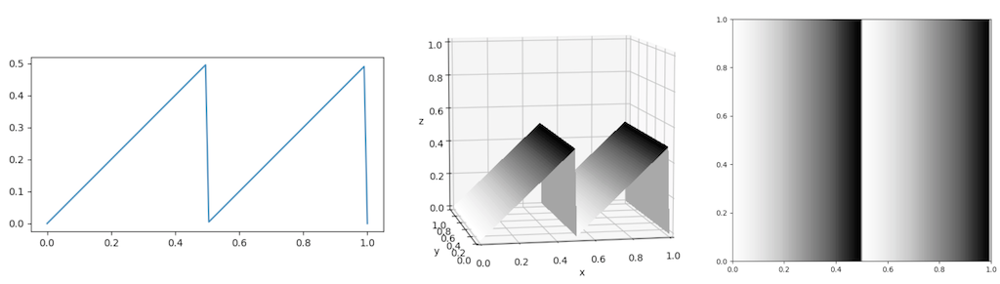]  


---
.header[Function Primitive Components]

## Modulo

With modulo you can easily iterate ranges and therefore loops, for example.

--

* `x % 10`
    *  `0 % 10 = 0`
    *  `1 % 10 = 1`
    *  `2 % 10 = 2`
    *  ...
    *  `9 % 10 = 9`
    *  `10 % 10 = 0`
    *  `11 % 10 = 1`
    *  ➝ 0..9, 0..9, 0..9


---
.header[Function Primitive Components]

## Floor

```js
y = floor(x);
```

.center[]  


Floor ignores fraction and creates with that a continuous step function.

---
.header[Function Primitive Components]

## Floor

floor might also be used to create continuos but repeating ranges.

```glsl
// Ridges
float d = distance(coord, vec2(0.5)); // 0..1

d *= 8.0; // 0..8
d -= floor(d); // 8x 0..1, 0..1, ...
```

The same with modulo:

```glsl
// Ridges
float d = distance(coord, vec2(0.5)); // 0..1

d *= 8.0; // 0..8
d = d % 1.0; // 8x 0..1, 0..1, ...
```

or GLSL < 3.0

```
d = mod(d, 1.0);
```


---
.header[Function Primitive Components]

## Absolute

```js
y = abs(x);
```

.center[]  

The absolute keeps values always positive.


---
.header[Function Primitive Components]

## Min and Max

```js
y = min(x, 0.5);
```

.center[]  

Min and Max are used to define lower and upper borders.


---
## Periodicity


[[wiki]](https://en.wikipedia.org/wiki/Square_wave#/media/File:Waveforms.svg)


???
.task[COMMENT:]  

* Often times we want to repeat certain visual features, which can be done in its simplest form e.g. with a `sin` function. However, there are several other design options. The following functions are also often called *wave functions*.

--

Wave functions have two common properties

* frequency (“*how often*”), and
* amplitude (“*how much*”).

---
.header[Periodicity]

## Square

The square wave enables a sharp oscillation between two values.

```glsl
float wave_square(float t, float frequency, float amplitude)
{
  return floor(t* frequency) % 2 * amplitude;
}
```

.center[]  

---
.header[Periodicity]

## Sawtooth

The sawtooth wave enables a jagged oscillation — a value increases linearly and then resets.

```glsl
float waveSawTooth(float t, float frequency, float amplitude)
{
  return (t * frequency - floor(t* frequency)) * amplitude;
}
```

.center[]  

---
.header[Periodicity]

## Triangle

The triangle wave enables a linear oscillation between two values.

```glsl
float waveTriangle(float t, float frequency, float amplitude)
{
  return abs((t * frequency) % amplitude - (0.5 * amplitude));
}
```

.center[]  

---
## Function Design

.center[]

---
## Function Design


.center[]  


???
.task[COMMENT:]  

* TODO: Hex?


---
template: inverse

### Chapter 08
# Tilings & The Universe

---

## Tilings


???
.task[COMMENT:]  

* What is a tiling?

--

A tiling is a flat surface with some pattern of geometric shapes (*tiles*), with no overlaps or gaps.  

---
## Tilings

.center[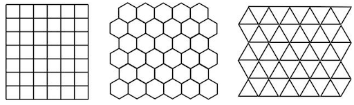  [[pi.math.cornell]](http://pi.math.cornell.edu/~mec/2008-2009/KathrynLindsey/PROJECT/Page2.htm)]


???
.task[COMMENT:]  

* triangles, squares and hexagons

---
## Tilings

So far, we have used simple grids to create repetitive patterns. However, grid with hexagons are also very commonly used!


--

.center[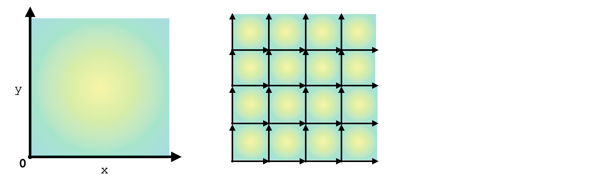]

---
## Tilings

So far, we have used simple grids to create repetitive patterns. However, grid with hexagons are also very commonly used!

.center[]


???
.task[COMMENT:]  

* In previous years I have explained how to create a hex tiling in glsl.
* Unreal would be the way to go: https://www.youtube.com/watch?v=hc6msdFcnA4

* https://www.youtube.com/watch?v=VmrIDyYiJBA


---
.header[Tilings]

## Hexagonal Grids


.center[]


???
.task[COMMENT:]  

* Another way to look at hexagonal grids is to see that there are three primary axes, unlike the two we have for square grids. There's an elegant symmetry with these.
* https://www.redblobgames.com/grids/hexagons

---
.header[Tilings]

## Hexagonal Grids


.center[]  
[[wiki]](https://en.wikipedia.org/wiki/Hex_map)


???
.task[COMMENT:]  

* Advantage of hex maps in games: consistent distance from center to center compared to squares.
* This distance is √3 times that of a hexagon side.

he primary advantage of a hex map over a traditional square grid map is that the distance between the center of each and every pair of adjacent hex cells (or hex) is the same. By comparison, in a square grid map, the distance from the center of each square cell to the center of the four diagonal adjacent cells it shares a corner with is √2 times that of the distance to the center of the four adjacent cells it shares an edge with. This equidistant property of all adjacent hexes is desirable for games in which the measurement of movement is a factor. The other advantage is the fact that neighbouring cells always share edges; there are no two cells with contact at only a point. 

* https://pro.arcgis.com/en/pro-app/latest/tool-reference/spatial-statistics/h-whyhexagons.htm

---
.header[Tilings]

## Hexagonal Grids


.center[]  
[[gamedev]](https://gamedev.stackexchange.com/questions/83412/hexagonal-game-board-modal)

---
.header[Tilings]

## Hexagonal Grids


.center[]  
[[gamedev]](https://gamedev.stackexchange.com/questions/83412/hexagonal-game-board-modal)


???
.task[COMMENT:]  

* https://www.shadertoy.com/view/4dGGzc


.center[[[wiki]](https://en.wikipedia.org/wiki/File:ChamferedHexTilingAnimation.gif)]

* A chamfered hexagonal tiling replacing edges with new hexagons and transforms into another hexagonal tiling. In the limit, the original faces disappear, and the new hexagons degenerate into rhombi, and it becomes a rhombic tiling. 
* https://www.youtube.com/watch?v=A-1O4BHdkfA

---
.header[Tilings]

## Hexagonal Grids in Nature?

--

.center[ [[documentarytube]](https://www.documentarytube.com/articles/the-hexagon-nature-s-most-powerful-creation/)]  

???
.task[COMMENT:]  

* Least amount of vax and most amount of storage space
* https://www.youtube.com/watch?v=QEzlsjAqADA
* [March is hexagonal awareness month](https://hexnet.org/content/hexagonal-awareness-month-2012)

--
> Why do honeybees love hexagons? Cause hexagons are the bestagons!

---
.header[Tilings]

## Hexagonal Grids in Nature


.center[ [[sciencephoto]](https://www.sciencephoto.com/media/161797/view)]  *Macrophotograph of a snow crystal showing characteristic hexagonal symmetry.*


???
.task[COMMENT:]  

* ach crystal is made up from water molecules, arranged with 2 hydrogen atoms making an angle of 105 degrees with 1 oxygen atom. The fixed shape of the water molecule means they can assume a stable crystal arrangement only when arranged as a 6-branched figure. Despite essential hexagonal similarity no two snowflakes are identical because their growth from cloud, through sky, to the ground is influenced by temperature, humidity, air currents etc. & these conditions are never identical for two snowflakes. Magnification: x5 (35mm size).

---
## Tilings


 [[pi.math.cornell]](http://pi.math.cornell.edu/~mec/2008-2009/KathrynLindsey/PROJECT/Page2.htm)

--

vs.

.center[]

???
.task[COMMENT:]  

* pentagon
* How could we create a tiling anyways?


---

## Tilings

The solution is to combine different shapes:

.center[]

--

.center[]

--

In the mathematical theory of tessellations, a **prototile** is one of the shapes of a tile in a tessellation.

---
.header[Tilings]

## Finding the Tile

Recognizing the *fundamental unit*, meaning the repeating *tile* of a pattern is a crucial step for constructing it. 


???
.task[COMMENT:]  

* And in the other way around, it is necessary to understand how the repetition of a tile will look like, when designing a tile. You will need to differentiate the shape of a tile, and what is shown on the tile. These two aspects are dependent, but often different. 

--


---
.header[Tilings]

## Finding the Tile

Recognizing the *fundamental unit*, meaning the repeating *tile* of a pattern is a crucial step for constructing it. 

Also, many tilings have more than one solution of how the tiles and designs might look like.


[[wiki]](https://en.wikipedia.org/wiki/Aperiodic_set_of_prototiles#/media/File:Fund_un_prim_cell.svg)


???
.task[COMMENT:]  

* And in the other way around, it is necessary to understand how the repetition of a tile will look like, when designing a tile. You will need to differentiate the shape of a tile, and what is shown on the tile. These two aspects are dependent, but often different. 


---

## Tilings

Tillings can have various properties and and various mathematical questions can be derived from them.

--

One defining aspect is the **symmetry** of the tiling.


???
.task[COMMENT:]  

* What is symmetry?

--

.center[[[wiki]](https://en.wikipedia.org/wiki/Symmetry)]

???
.task[COMMENT:]  

* Symmetry is a fundamental organizational concept in art as well as science. To develop and exploit this concept to its fullest, it must be given a precise mathematical formulation. This has been a primary motivation for developing the branch of mathematics known as “group theory.” 
* https://geocalc.clas.asu.edu/pdf-preAdobe8/SymmetryGroups.pdf
* Symmetry (from Ancient Greek: συμμετρία symmetria "agreement in dimensions, due proportion, arrangement")[1] in everyday language refers to a sense of harmonious and beautiful proportion and balance


---
.header[Tilings]

## Symmetry

.center[[[wiki]](https://en.wikipedia.org/wiki/Symmetry)]


A geometrical figure is **symmetrical** if we can permute its parts with certain transformations, while leaving the object as a whole unchanged.

--

Transformations include translation, reflection, rotation or scaling.


???
.task[COMMENT:]  

* Mathematical symmetry may be observed with respect to the passage of time; as a spatial relationship; through geometric transformations; through other kinds of functional transformations; and as an aspect of abstract objects, including theoretic models, language, and music.
*     An object has reflectional symmetry (line or mirror symmetry) if there is a line (or in 3D a plane) going through it which divides it into two pieces that are mirror images of each other.[6]
    An object has rotational symmetry if the object can be rotated about a fixed point (or in 3D about a line) without changing the overall shape.[7]
    An object has translational symmetry if it can be translated (moving every point of the object by the same distance) without changing its overall shape.[8]
    An object has helical symmetry if it can be simultaneously translated and rotated in three-dimensional space along a line known as a screw axis.[9]
    An object has scale symmetry if it does not change shape when it is expanded or contracted.[10] Fractals also exhibit a form of scale symmetry, where smaller portions of the fractal are similar in shape to larger portions.[11]
    Other symmetries include glide reflection symmetry (a reflection followed by a translation) and rotoreflection symmetry (a combination of a rotation and a reflection[12]).
https://en.wikipedia.org/wiki/Symmetry

--

Symmetries can be described in precise mathematical formulation within the branch of **group theory**. 

.footnote[[[David Hestenes]](https://geocalc.clas.asu.edu/pdf-preAdobe8/SymmetryGroups.pdf)]

---
.header[Tilings]

## Symmetry

The symmetries of the pentagon under reflections and rotations:

.center[[[math.stackexchange]](https://math.stackexchange.com/questions/490054/symmetries-of-a-pentagon)]

---
.header[Tilings | Symmetry]

## Wallpaper Groups

A wallpaper group (or plane symmetry group) is in a mathematical classification of a two‑dimensional repetitive pattern, based on the symmetries in the pattern.

???
.task[COMMENT:]  

* http://xahlee.info/Wallpaper_dir/c5_17WallpaperGroups.html
* https://math.hws.edu/eck/js/symmetry/wallpaper.html
* https://tessellations.ca/
* KaleidoPaint iPad app
* https://apps.apple.com/us/app/kaleidopaint/id518275953


--

<iframe width="791" height="445" src="https://www.youtube.com/embed/m8aUEqLqy_g" title="Creating tessellations - a quickie Louis Cube" frameborder="0" allow="accelerometer; autoplay; clipboard-write; encrypted-media; gyroscope; picture-in-picture; web-share" allowfullscreen></iframe>


## Tilings

.center[  [[pi.math.cornell]](http://pi.math.cornell.edu/~mec/2008-2009/KathrynLindsey/PROJECT/Page2.htm)] 


???
.task[COMMENT:]  

* A tiling is said to be *periodic* if there exist, among the symmetries of the tiling, at least two translations in non-parallel directions. 
* The tiling below is an example of a periodic tiling; the green arrows indicate two non-parallel translations that are symmetries of the tiling. 


## Tilings

.center[  [[pi.math.cornell]](http://pi.math.cornell.edu/~mec/2008-2009/KathrynLindsey/PROJECT/Page2.htm)] 


???
.task[COMMENT:]  

* A non-periodic tiling can not simply be constructed based on two translations in non-parallel directions.
* Above, the central star occurs nowhere else in the tiling, and so no translations are possible.
* A much more complex question is to ask which shapes can tile a plane in a pattern that does not repeat?

---

## Tilings

Squares, triangles, hexagons all do the trick producing well known periodic structures and are often used as an underlying spatial setup for any kind patterns.

---

## Tilings

Mathematicians have a lot of fun with the formal site of tilings.

> Which shapes can tile a plane in a pattern that does not repeat? 

---

## Aperiodic Tilings

.center[]
[[aperiodictiling]](https://www.aperiodictiling.org/wpaperiodictiling/) *Penrose rhomb tile*

--

A non-repeating pattern, is call an *aperiodic* tiling. Hence, a set of polygons tile the plane but never form a periodic tiling.


???
.task[COMMENT:]  


  
* This means the pattern is not constructable by simple translations of potentially arbitrarily large periodic patches. Shifting an aperiodic tiling cannot produce the same tiling. 
* It is not possible to create the tiling by taking some (potentially very large) section and repeating it over and over again. 
* Around 1973/74 Roger Penrose found a set of two tiles that only tile non periodically. 
* Shifting an aperiodic tiling cannot produce the same tiling. A set of prototiles is aperiodic if copies of these tiles can form only non-periodic tilings.  


---

## Aperiodic Tilings


There are only a few constructions of aperiodic tilings known. The first aperiodic set was constructed by Robert Berger in 1966 and it contained 20426 prototiles!  

The next obvious question is 
> Can we find a smaller set of aperiodic prototiles?  

and, in particular,

> What is the smallest number of prototiles necessary to tile the plane aperiodically?


???
.task[COMMENT:]  
 
After Berger's discovery, various mathematicians considered this question and discovered sets of aperiodic prototiles with fewer and fewer prototiles.  

One well-known set of six aperiodic prototiles was in 1971 by [Raphael M. Robinson](https://en.wikipedia.org/wiki/Raphael_M._Robinson). The set is a *aperiodic hierarchical tiling*, meaning something along the lines of *a set of tiles admitting only non-periodic tilings with a hierarchical structure*.

  
[[wiki]](https://en.wikipedia.org/wiki/Penrose_tiling#/media/File:Robinson_tiles.svg) *The Robinson Tiles*

Any tiling by these tiles can only exhibit a hierarchy of squares: each orange square is at the corner of a larger orange square, ad infinitum. Any translation must be smaller than some size of square, and so cannot leave any such tiling unchanged 🤯.

  
[[wiki]](https://en.wikipedia.org/wiki/Aperiodic_tiling#/media/File:Robinson_tiling.jpg)

---
.header[Tilings]

## Final Thoughts

---
.header[Tilings]

## Final Thoughts - Substitution Rules

Substitutions or also called inflation and deflation are for tilings a powerful additional design mechanism. It can give tilings a fractal feel with self similarities.

.center[[[wiki]](https://en.wikipedia.org/wiki/Symmetry#/media/File:BigPlatoBig.png)]


???
.task[COMMENT:]  

* A fractal-like shape that has reflectional symmetry, rotational symmetry and self-similarity, three forms of symmetry. This shape is obtained by a finite subdivision rule.
* https://en.wikipedia.org/wiki/Finite_subdivision_rule


---
.header[Tilings]

## Final Thoughts - M.C. Escher


.center[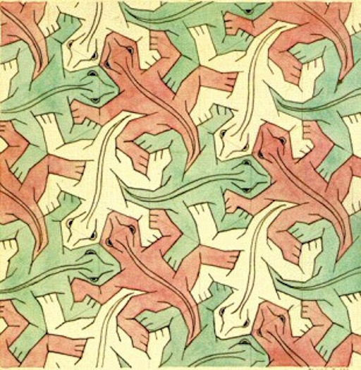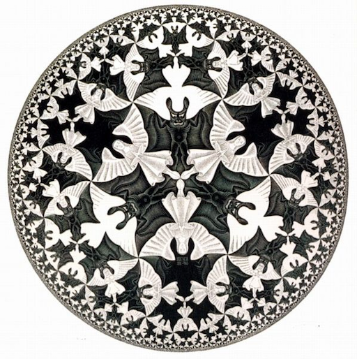]

Left: *Hexagonal tessellation with animals: Study of Regular Division of the Plane with Reptiles (1939). Right: *M.C. Escher, Circle Limit IV (Heaven and Hell) (1960).*

???
.task[COMMENT:]  

* Maurits Cornelis Escher (June 17 1898 – March 27 1972), usually referred to as M. C. Escher, was a Dutch graphic artist known for his often mathematically inspired woodcuts, lithographs and mezzotints which feature impossible constructions, explorations of infinity, architecture, and tessellations. 


* One can not talk about tilings without mentioning the work of M.C. Escher. Creating plane tiling by recognizable figures was Escher's first groundbreaking artistic technique. He called it *the regular subdivision of the plane*. Escher's works feature complex and whimsical figures, mostly animals, which magically interlock to cover the printed page. Creating these mathematically constrained outlines is no easy process, and Escher was unquestionably the master. His technique was to start with a simple tessellation by geometric shapes, and then evolve it into a recognizable figure. If interested, I recommend the site [Math and the Art of M. C. Escher](https://mathstat.slu.edu/escher/index.php/Math_and_the_Art_of_M._C._Escher) and in regard to spiral tilings [Escher-like Spiral Tilings](https://isohedral.ca/escher-like-spiral-tilings/).

### What is the circular pattern based on?

* The above circular image is based on the concept of [hyperbolic geometry](https://en.wikipedia.org/wiki/Hyperbolic_geometry). It is one type of non-Euclidean geometry, satisfying all of Euclid's postulates except the *[parallel postulate](https://en.wikipedia.org/wiki/Parallel_postulate)*. 
* The parallel postulate states that if one straight line crosses two other straight lines to make both angles on one side less than 90˚, then the two lines meet. Proving that triangles have 180˚ angle sums is an application of this postulate [4, as cited in [[19]](http://web.colby.edu/thegeometricviewpoint/category/hyperbolic-geometry/)]. However, the parallel postulate need not hold true in all cases, such as on the surface of a sphere.  For hyperbolic geometry, the postulate is modified to read: For any infinite straight line *L* and any point *P* not on it, there are many other infinitely extending straight lines that pass through *P* and which do not intersect *L*. Tilings in hyperbolic space look great, e.g. based in the [Poincaré disk model](https://en.wikipedia.org/wiki/Poincar%C3%A9_disk_model) - but this is really hard stuff...

---
.header[Tilings]

## Final Thoughts - Hyperbolic Plane Tilings

.center[[[plunk]](http://www.plunk.org/~hatch/HyperbolicTesselations/)]

???
.task[COMMENT:]  

* The above circular image is based on the concept of [hyperbolic geometry](https://en.wikipedia.org/wiki/Hyperbolic_geometry). It is one type of non-Euclidean geometry, satisfying all of Euclid's postulates except the *[parallel postulate](https://en.wikipedia.org/wiki/Parallel_postulate)*. 
* The parallel postulate states that if one straight line crosses two other straight lines to make both angles on one side less than 90˚, then the two lines meet. Proving that triangles have 180˚ angle sums is an application of this postulate [4, as cited in [[19]](http://web.colby.edu/thegeometricviewpoint/category/hyperbolic-geometry/)]. However, the parallel postulate need not hold true in all cases, such as on the surface of a sphere.  For hyperbolic geometry, the postulate is modified to read: For any infinite straight line *L* and any point *P* not on it, there are many other infinitely extending straight lines that pass through *P* and which do not intersect *L*. Tilings in hyperbolic space look great, e.g. based in the [Poincaré disk model](https://en.wikipedia.org/wiki/Poincar%C3%A9_disk_model) - but this is really hard stuff...


---
template:inverse

# Islamic Patterns

---
## Islamic Patterns


.center[]


---
## Islamic Art

Covers a wide range of lands, periods, and genres.

--

Began in the 8th century

* Influences Roman and Persian cultures
* Islamic Golden age
    * 8th century to the 14th century
    * Fundamental advancements in science and mathematics
    * Resulting also in complex geometry in art

---
## Islamic Art

> Patterns are everywhere...

--

Some interpretations of Islam include a ban of depiction of animate beings

* Prohibition of idolatry
* Belief that creation of living forms is God's prerogative


???
.task[COMMENT:]  

* also known as aniconism

--

Characterized by three recurrent motifs


???
.task[COMMENT:]  

Based on this exclusion of depicting any figural form of living creatures, there are three distinct disciplines that constitute the core elements of Islamic art, namely

--
1. Calligraphy

--
2. Arabesques

--
3. Geometry

---
.header[Islamic Art]
## Calligraphy

Chapters and excerpts from the Qur'an are a common.

--

There are two major styles: Kufic and Naskh.


???
.task[COMMENT:]  

* Kufic is the oldest calligraphic form of the various Arabic scripts and consists of a modified form of the old Nabataean script. Kufic developed around the end of the 7th century in Kufa, Iraq, from which it takes its name, and other centres
* Naskh (Arabic: قلم النسخ, translit. qalam an-naskh, from نسخ, nasakha, "to copy") is a smaller, round script of Islamic calligraphy. Naskh is one of the first scripts of Islamic calligraphy to develop, commonly used in writing administrative documents and for transcribing books, including the Qur’an, because of its easy legibility. Naskh was standardized by Ibn Muqla as one of the six primary scripts of Islamic calligraphy in the 10th century CE.[1]

--

.center[]

---
.header[Islamic Art]
## Arabesque

"Surface decorations based on rhythmic linear patterns of scrolling and interlacing foliage, tendrils" or plain lines.

--

Used to symbolize the transcendent, indivisible and infinite nature of God.


.center[]

---
.header[Islamic Art]
## Geometry

Patterns and tile work that seem to repeat infinitely

--
* Kaleidoscopic effects

--
* Inspiring contemplation of eternal order


---

## Islamic Patterns


???
.task[COMMENT:]  

* What simple construction tools are the basis of Islamic pattern designs?

--

Traditional Islamic art is composed with only compasses and a ruler. Therefore, designs are based on circles and lines.

  
[[ricoflow]](https://www.youtube.com/watch?v=FqBWjJQKICk)

---

## Islamic Patterns

.center[] 

The circle as a symbol of unity and as ultimate source of all diversity in creation.

???
.task[COMMENT:]  

* Each design starts with a circle. 
* The division of the circle into regular divisions is a ritual starting point

---
.header[Islamic Patterns]

## Circle Division

.center[] 

Each division gives rise to a specific group of patterns.

---
.header[Islamic Patterns]

## Circle Division

.center[] 

These are called 4, 5 and 6-folds.

---
.header[Islamic Patterns]

## Circle Division

.center[] 

---
.header[Islamic Patterns]

## Circle Division

.center[] 


---

## Islamic Patterns

--

1. Cell design with construction lines
2. Tessellation

???
.task[COMMENT:]  

Construction lines
* Normally Invisible
* Determine the scale
* Maintain accuracy

--

Many different designs can be derived from the same construction lines by picking different segments.


---
.header[Islamic Patterns]

## Construction Example

--

> Trying to decipher the steps that led to finished patterns is like a mathematical puzzle. Constructing new pieces involves creativity mixed with an understanding of the various styles and embellishments the ancients used.

---
.header[Islamic Patterns]

## Construction Example

.center[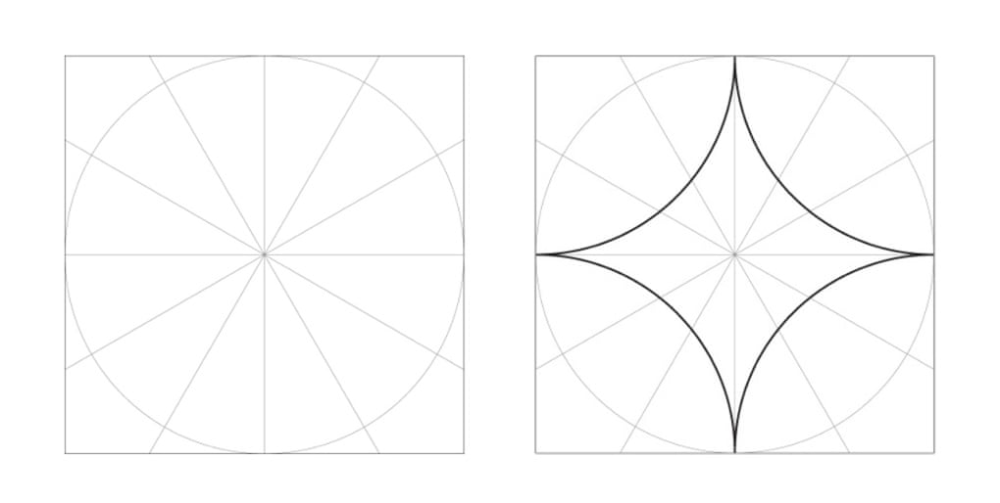] 


---
.header[Islamic Patterns]

## Construction Example

.center[] 


---
.header[Islamic Patterns]

## Construction Example

.center[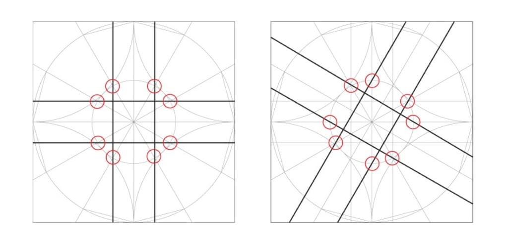] 


---
.header[Islamic Patterns]

## Construction Example

.center[] 


???
.task[COMMENT:]  

.center[] 


---
.header[Islamic Patterns]

## Construction Example

.center[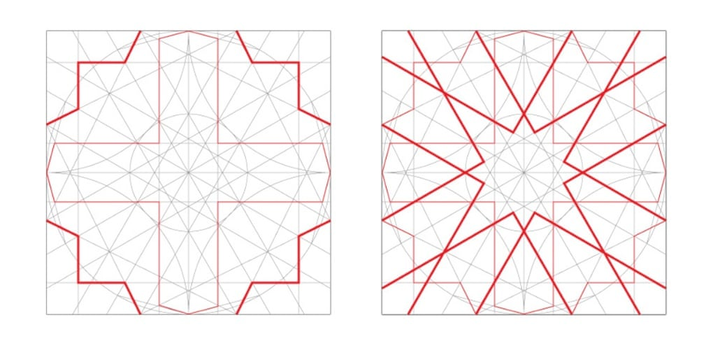] 

---

## Islamic Patterns

Many different designs can be derived from the same construction lines by picking different segments.

--

.center[] 

---

## Islamic Patterns

.center[] 

---

## Islamic Patterns

.center[] 

---

## Islamic Patterns

.center[] 


---
.header[Islamic Patterns]

## Implementation

.center[] 

---
.header[Islamic Patterns]

## Implementation

.center[] 

---
.header[Islamic Patterns]

## Implementation

.center[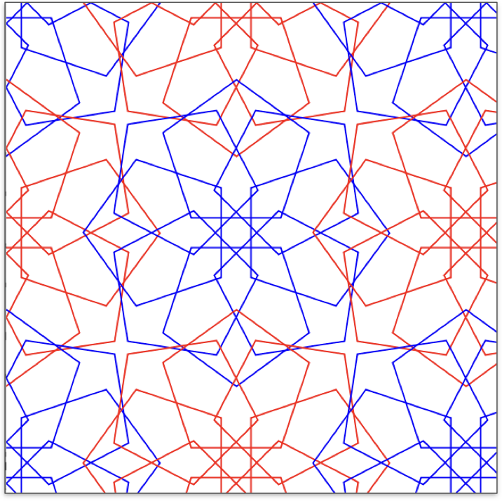] 

---
.header[Islamic Patterns]

## Implementation

.center[] 

---
.header[Islamic Patterns]

## Implementation

.center[] 


---
.header[Islamic Patterns]

## Implementation

.center[] 


---
.header[Islamic Patterns]

## Implementation

.center[] 

---
.header[Islamic Patterns]

## Implementation

.center[] 


---

## Islamic Patterns

.center[ [[wiki]](https://en.wikipedia.org/wiki/File:Roof_hafez_tomb.jpg)]


???
.task[COMMENT:]  

* Complex girih patterns with 16-, 10- and 8-point stars at different scales in ceiling of the Tomb of Hafez in Shiraz, 1935.

* Through their intricate design, patterns and tile work often appear to repeat infinitely, with kaleidoscopic effects. This might be understood as invitation to contemplate eternal order.

* https://www.youtube.com/user/zelligh/videos


---
template:inverse

# Sacred Geometry


???
.task[COMMENT:]  

* 
* Speaking of religion, there is a discipline called *sacred geometry*. Sacred geometry ascribes symbolic and sacred meanings to certain geometric shapes and certain geometric proportions [1, as cited in [[7]](https://en.wikipedia.org/wiki/Sacred_geometry)]. It is associated with the belief that god is a mathematician, specializing in geometry, applying this mastery when building the world. Here, the synchronicity of the universe is determined by certain mathematical constants, which express themselves in the form of patterns and cycles in nature. The geometry used in the design and construction of religious structures such as churches, temples, mosques, religious monuments, altars, and tabernacles has then sometimes been considered sacred. 

[[7]](https://en.wikipedia.org/wiki/Sacred_geometry) [[8]](http://www.ancient-wisdom.com/sacredgeometry.htm)  


---
.header[Sacred Geometry]

## The Pentagram of Venus

--

A slightly simplified visualization of the path that Venus as observed from Earth:

.center[]  
  
[[Greg Evans]](http://www.gregegan.net/) cited by [[johncarlosbaez]](https://johncarlosbaez.wordpress.com/2014/01/04/the-pentagram-of-venus/)


???
.task[COMMENT:]  

* The image shows the plane of the solar system with the earth positioned at the centre of the diagram and the curve representing the direction and distance of Venus as a function of time. This is called *the pentagram of venus* or the *rose of venus*.
* With the passage of one year, the sun goes around the earth. As the sun goes around the earth 8 times, venus goes around the sun 13 times, then the same paths start again.  

---
.header[Sacred Geometry]

## The Pentagram of Venus

.center[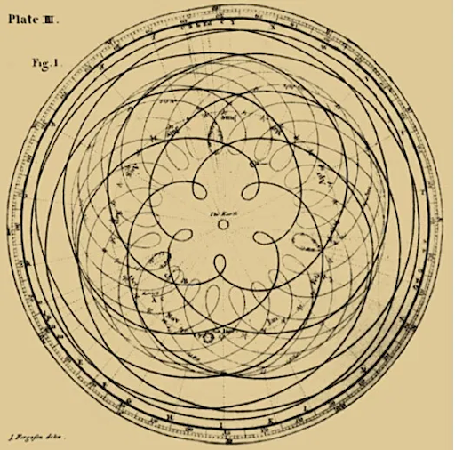]  
  
[[johncarlosbaez]](https://johncarlosbaez.wordpress.com/2014/01/04/the-pentagram-of-venus/) *Detail from James Ferguson’s, Astronomy Explained Upon Sir Isaac Newton’s Principles, 1799 ed., plate III, opp. p. 67.*


???
.task[COMMENT:]  

* This is also called the pentagram of Venus, because the path has 5 ‘lobes’ where Venus makes its closest approach to Earth. At each closest approach, Venus move backwards compared to its usual motion across the sky: this is called [retrograde motion](https://en.wikipedia.org/wiki/Apparent_retrograde_motion).  

---
.header[Sacred Geometry]

## The Pentagram of Venus

When seen from a sun-centered perspective, it looks as follows:

.center[]  
  
[[The (Almost) Venus-Earth Pentagram by Steven Dutch, Professor Emeritus, Natural and Applied Sciences,University of Wisconsin]](https://stevedutch.net/Astron-CosmosNotes/Earth-Venus.htm?)


???
.task[COMMENT:]  

*On a side note*: the orbits are approximated as circles, so this animation cannot be used for accurate predictions. The earth moves faster in December than June, so conjunctions don't occur with quite the regular spacings shown here.

As you see in the above animation, the mentioned numbers are only *approximately* true. It's remarkable, but not perfect. The earth orbits the sun once every *365.256* days. Venus orbits the sun once every *224.701* days. So, venus orbits the sun in *224.701 / 365.256 ≈ 0.615187* earth years. *8/13 ≈ 0.615385* is pretty close to the just computed *0.615187*, but, in fact, in 8 earth years, venus goes around the sun *13.004* times. So the whole pattern keeps shifting. It makes a full turn about once every 1920 years. (Remember the *The Da Vinci Code*? Dan Brown makes a big deal of the perfect five pointed star that Venus makes in the sky - which is just not true...).  

Naturally, some people get too excited about all this stuff. For example, some cherish the fact that a Latin name for the planet Venus is *Lucifer*. Lucifer, pentagrams… woahhhh.

Nonetheless, as I have said it many times before: the universe is full of mathematical beauty. It seems we need to get closer and closer to the fundamental laws of nature to make the math and the universe match more and more accurately. Maybe that’s what *fundamental laws* means. But the universe is also richly packed with beautiful *approximate* mathematical patterns, stacked on top of each other in perplexing ways - maybe following laws which are just to complex for our tiny brains.

[[10]](https://johncarlosbaez.wordpress.com/2014/01/04/the-pentagram-of-venus/)
[[11]](https://stevedutch.net/Astron-CosmosNotes/Earth-Venus.htm?)

---
.header[Sacred Geometry]

## The Seed of Life

.center[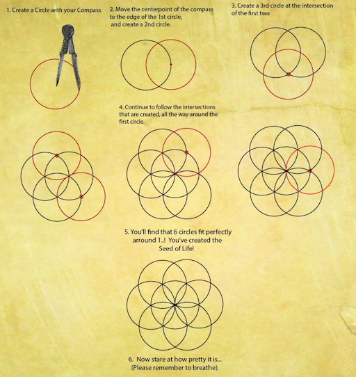]  

[[travelingalchemists]](https://travelingalchemists.wordpress.com/)

???
.task[COMMENT:]  

* From the The Traveling Alchemists’ Outreach Society
* The above image, depicts the *seed of life*, which is believed to be an ancient geometric universal symbol for all creation.

---
.header[Sacred Geometry]

## The Seed of Life

.center[]  

[[etemetaphysical]](https://blog.etemetaphysical.com/seedoflife/)


???
.task[COMMENT:]  

 *Top row, left to right:  Variations on the central rosette on 17th century BCE Greek coins, an early 15th century CE Arabic tile, and the Gundestrup cauldron of Denmark.  Middle row, left to right:  Examples of the rosette net pattern on a 1st century BCE mosaic in Israel, a monastery window on Crete, and a sketch by Leonardo da Vinci.  Bottom row, left to right: The rosette can be used to generate more complicated geometric patterns like the rose window of Saint Stephen’s cathedral in Vienna, a 2nd century CE Roman mosaic in France, and an early 17th century Chinese illumination for a Qu’ran. Image Source: Public domain, Wikimedia Commons.* [[9]](https://blog.etemetaphysical.com/seedoflife/)  

**Well, believe what you want to believe. I am all for an appreciation of maths and geometry but let me just throw into the discussion here that maybe the *seed of life* design has been around for so long because it is easy to create with compasses and looks nice.**


---
.header[Sacred Geometry]

## Motion Art Therapy

.center[]  

.footer[[[Forging Mind]]((https://www.forgingmind.com/collections/frontpage/products/bioluminescence)]

???
.task[COMMENT:]  

* Also, have a look at these designs, which are loosely based on the principles of the previous sections and what is considered sacred geometry. The authors call these examples *motion art therapy* and claim that these videos *create solutions for your customers around mindfulness, instructional videos, guided meditations, affirmations, improving mental health and managing stress*:
* https://store.forgingmind.com/l/gsgmt

---
.header[Sacred Geometry]

## Motion Art Therapy

.center[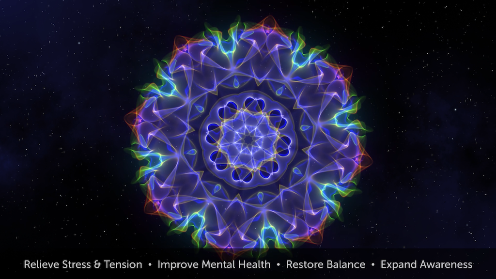]  

.footer[[[Forging Mind]]((https://www.forgingmind.com/collections/frontpage/products/bioluminescence)]

???
.task[COMMENT:]  

* Also, have a look at these designs, which are loosely based on the principles of the previous sections and what is considered sacred geometry. The authors call these examples *motion art therapy* and claim that these videos *create solutions for your customers around mindfulness, instructional videos, guided meditations, affirmations, improving mental health and managing stress*:
* https://store.forgingmind.com/l/gsgmt

---
.header[Sacred Geometry]

## Motion Art Therapy

.center[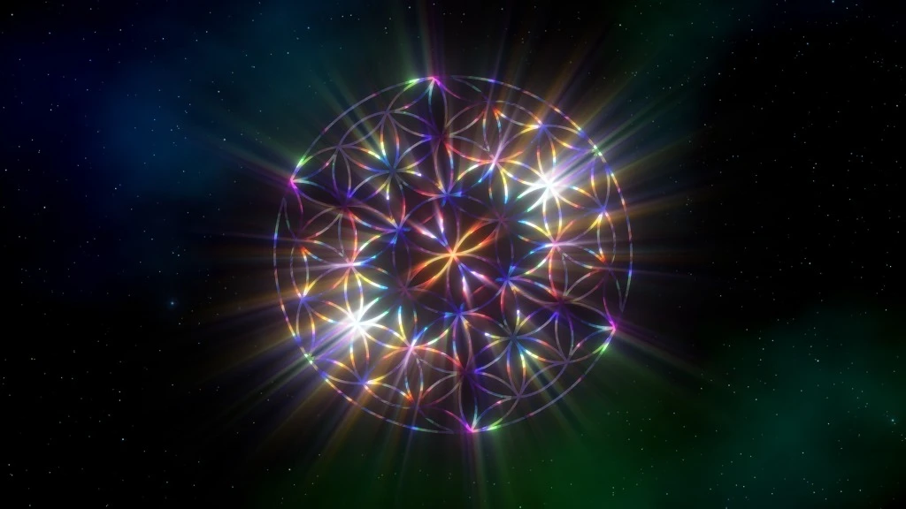]  

.footer[[[Forging Mind]]((https://www.forgingmind.com/collections/frontpage/products/bioluminescence)]

???
.task[COMMENT:]  

* Also, have a look at these designs, which are loosely based on the principles of the previous sections and what is considered sacred geometry. The authors call these examples *motion art therapy* and claim that these videos *create solutions for your customers around mindfulness, instructional videos, guided meditations, affirmations, improving mental health and managing stress*:
* https://store.forgingmind.com/l/gsgmt


---
template:inverse

# Next

---
.header[Next]

## Noise Functions

Next we are going to add one more brush to our tool box: noise functions!

.center[  [[thebookofshaders]](https://thebookofshaders.com/11/)]

---
template:inverse

# Exercise

---

## Exercise

### Task 02.01 - Creative Project Development Numbers and Curves


???
.task[COMMENT:]  

Develop a creative and / or visual and / or auditive concept in regard to one of the topics of Chapter 3, be it a number or numbers, spirals or specific curves, or all of them. The project doesn’t need to be executable by you but you should be able to plan it thoroughly. Imagine it as if you are the creative and technical director but you don’t have to do everything yourself. You can use any setup, framework, tool, etc. you like for this concept, it does not have to be with Unreal.

This concept should ideally include

* the idea and goal,
* references and inspiration (feel free to investigate your topic further),
* the specific concept,
* optional: concept sketches,
* execution and implementation details on how to do it.


---

## Exercise

### Task 02.02 - Procedural Generation Plugin 


---
template:inverse

## The End

# 👋🏻
