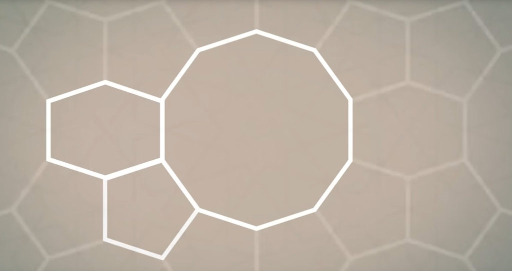
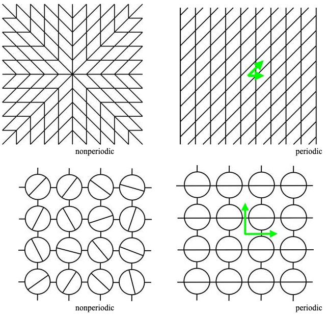
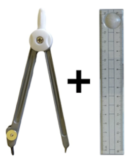
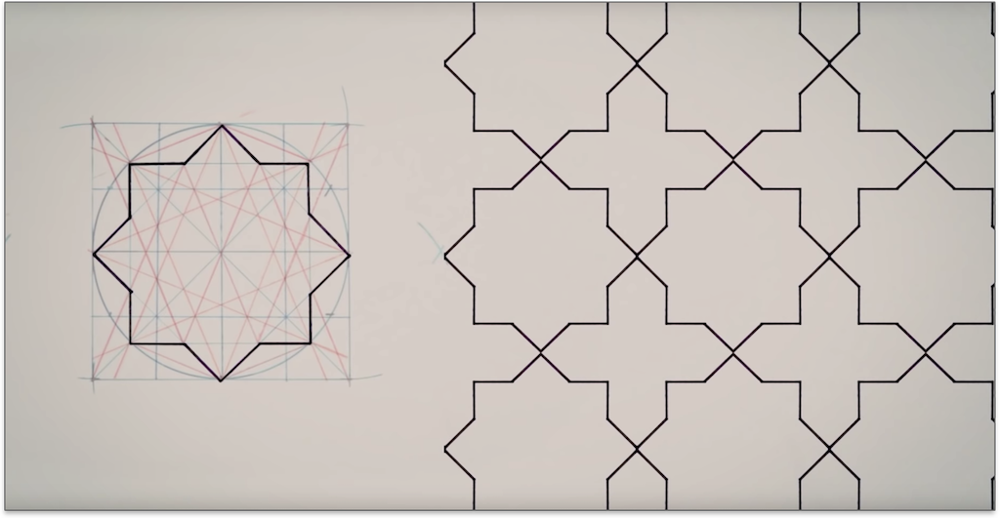

name: inverse
layout: true
class: center, middle, inverse
---


# Procedural Generation and Simulation

### Prof. Dr. Lena Gieseke | l.gieseke@filmuniversitaet.de  

#### Film University Babelsberg KONRAD WOLF


---
layout: false

## Today

* Recap

--
* Homework

--
* Noise

---

## Today

.center[  
[[thebookofshaders]](https://thebookofshaders.com/12/)]


 


---

## Today

.center[ vs.   
[[scratchapixel]](https://www.scratchapixel.com/lessons/procedural-generation-virtual-worlds)]


---
template: inverse

### Chapter 04
#  Function Design

---
## Function Design

.center[]    


> The idea is to modify, shape and to combine different functions. 


---
## Function Design

### Task 03.02 - Brick Pattern


.center[]  


???
.task[COMMENT:]  

* bricks.frag

---
.header[Function Design]

## Brick Pattern

.center[]

---
.header[Function Design]

## Brick Pattern

```glsl
float BRICK_W = 0.3;  
float BRICK_H = 0.1; 
float MORTAR =  0.02; 

vec2 coord = gl_FragCoord.xy/u_resolution;
```

* `coord` is the coordinate of the current fragement to shade
* `coord` is normalized to run between 0..1

--

Let's say our window has a width of 512 and `gl_FragCoord.x` is `200`:

* `200 / 512 = 0,39`


???
.task[COMMENT:]  

The fragement coordinates are mapped to 0..1


---
.header[Function Design]

## Brick Pattern

Computing the size of one cell:

```glsl
float brick_mortar_w = BRICK_W + MORTAR;
float brick_mortar_h = BRICK_H + MORTAR;
```

--

.center[]


---
.header[Function Design]

## Brick Pattern

```glsl
float BRICK_W = 0.3;  
float BRICK_H = 0.1; 
float MORTAR =  0.02; 

vec2 coord = gl_FragCoord.xy/u_resolution;

float brick_mortar_w = BRICK_W + MORTAR;
float brick_mortar_h = BRICK_H + MORTAR;

// ?
float x = coord.x / brick_mortar_w;
float y = coord.y / brick_mortar_h;
```

---
.header[Function Design]

## Brick Pattern

```glsl
float BRICK_W = 0.3;  
float BRICK_H = 0.1; 
float MORTAR =  0.02; 

vec2 coord = gl_FragCoord.xy/u_resolution;

float brick_mortar_w = BRICK_W + MORTAR;
float brick_mortar_h = BRICK_H + MORTAR;

// CREATE THE TILING
// The value range is converted from 0..1.0
// to 0.0..number_of_tiles, 
// where one tile runs from n_tile..n_tile + 1
float x = coord.x / brick_mortar_w;
float y = coord.y / brick_mortar_h;
```

--

* `brick_mortar_w = 0.32`, `coord.x = 0..1`

--
    * `0.1 / 0.32 = 0.312`
    * `0.25 / 0.32 = 0.78`
    * `0.5 / 0.32 = 1.56`
    * `0.75 / 0.32 = 2.34`
    * `1.0 / 0.32 = 3.125`


Let's say our window has a width of 512 and `gl_FragCoord.x` is `200`:

* `200 / 512 = 0,39`

---
.header[Function Design]

## Brick Pattern

```glsl
float BRICK_W = 0.3;  
float BRICK_H = 0.1; 
float MORTAR =  0.02; 

vec2 coord = gl_FragCoord.xy/u_resolution;

float brick_mortar_w = BRICK_W + MORTAR;
float brick_mortar_h = BRICK_H + MORTAR;

// CREATE THE TILING
// The value range is converted from 0..1.0
// to 0.0..number_of_tiles, 
// where one tile runs from n_tile..n_tile + 1
float x = coord.x / brick_mortar_w;
float y = coord.y / brick_mortar_h;

float mortar_half_norm_w = (MORTAR * 0.5) / brick_mortar_w;
float mortar_half_norm_h = (MORTAR * 0.5) / brick_mortar_h;
```

Applying the same (coordinate) transformation to the given mortar sizing.

---
.header[Function Design]

## Brick Pattern

```glsl
float x = coord.x / brick_mortar_w;
float y = coord.y / brick_mortar_h;

// ?
float y_index = floor(y);
if( mod(y_index, 2.0 ) == 0.0)
{
    x += 0.5;
}
```


---
.header[Function Design]

## Brick Pattern

```glsl
float x = coord.x / brick_mortar_w;
float y = coord.y / brick_mortar_h;

// SHIFTING EVERY OTHER ROW
// Shift the brick x position in 
// every other row
float y_index = floor(y);
if( mod(y_index, 2.0 ) == 0.0)
{
    x += 0.5;
}
```

--
* `y1 = 1.4`, `y1 = 2.6`

--
* `y_index1 = 1`, `y_index2 = 2`

--
* `mod(1.0, 2.0 ) == 0.0` => false
* `mod(2.0, 2.0 ) == 0.0` => true
    * `x1 += 0.5`

--

.center[]


---
.header[Function Design]

## Brick Pattern

```glsl
// SHIFTING EVERY OTHER ROW
float y_index = floor(y);
if( mod(y_index, 2.0 ) == 0.0)
{
    x += 0.5;
}

// ?
x -= floor(x);
y -= y_index;
```


---
.header[Function Design]

## Brick Pattern

```glsl
// SHIFTING EVERY OTHER ROW
float y_index = floor(y);
if( mod(y_index, 2.0 ) == 0.0)
{
    x += 0.5;
}

// COORDINATE NORMALIZATION
// x,y should run again between 0..1 on a single brick
// (including one-half of the mortar around the brick)
x -= floor(x);
y -= y_index;
```

--
* `1.4` => `0.4`, `2.6` => `0.6`


---
.header[Function Design]

## Brick Pattern

```glsl
// Simplified version

// ?
float w = step(mortar_half_norm_w, x) - step(1.0 - mortar_half_norm_w, x);
float h = step(mortar_half_norm_h, y) - step(1.0 - mortar_half_norm_h, y);
```

---
.header[Function Design]

## Brick Pattern

```glsl
// CREATING THE BRICK "OUTLINE"
float w = step(mortar_half_norm_w, x) - step(1.0 - mortar_half_norm_w, x);
```

---
.header[Function Design]

## Brick Pattern

```glsl
// CREATING THE BRICK "OUTLINE"
float w = step(mortar_half_norm_w, x);
```

.center[]

> 0.0 is returned if x < t, and 1.0 is returned otherwise. 


???
.task[COMMENT:]  

* https://docs.gl/el3/step


---
.header[Function Design]

## Brick Pattern

```glsl
// CREATING THE BRICK "OUTLINE"
float w = step(mortar_half_norm_w, x);
```

.center[]

---
.header[Function Design]

## Brick Pattern

```glsl
// CREATING THE BRICK "OUTLINE"
float w = step(mortar_half_norm_w, x);
```

.center[]


---
.header[Function Design]

## Brick Pattern

```glsl
// CREATING THE BRICK "OUTLINE"
// float w = step(mortar_half_norm_w, x) - step(1.0 - mortar_half_norm_w, x);
float w = step(1.0 - mortar_half_norm_w, x);
```

.center[]


---
.header[Function Design]

## Brick Pattern

```glsl
// CREATING THE BRICK "OUTLINE"
// float w = step(mortar_half_norm_w, x) - step(1.0 - mortar_half_norm_w, x);
float w = step(1.0 - mortar_half_norm_w, x);
```

.center[]

---
.header[Function Design]

## Brick Pattern

```glsl
// CREATING THE BRICK "OUTLINE"
float w = step(mortar_half_norm_w, x) - step(1.0 - mortar_half_norm_w, x);
```

.center[]

---
.header[Function Design]

## Brick Pattern

```glsl
// CREATING THE BRICK "OUTLINE"
float w = step(mortar_half_norm_w, x) - step(1.0 - mortar_half_norm_w, x);
```

.center[]

---
.header[Function Design]

## Brick Pattern

```glsl
// Simplified version

// CREATING THE BRICK "OUTLINE"
float w = step(mortar_half_norm_w, x) - step(1.0 - mortar_half_norm_w, x);
float h = step(mortar_half_norm_h, y) - step(1.0 - mortar_half_norm_h, y);
```


.center[]

---
.header[Function Design]

## Brick Pattern

```glsl
// ?
float w = smoothstep(0.0, mortar_half_norm_w, x) 
           - smoothstep(1.0 - mortar_half_norm_w, 1.0, x);
float h = smoothstep(0.0, mortar_half_norm_h, y) 
           - smoothstep(1.0 - mortar_half_norm_h, 1.0, y);
```

---
.header[Function Design]

## Brick Pattern

```glsl
float w = smoothstep(0.0, mortar_half_norm_w, x);
```
--

> smoothstep returns 0.0 if x ≤ edge0 and 1.0 if x ≥ edge1. 


???
.task[COMMENT:]  

https://docs.gl/el3/smoothstep


---
.header[Function Design]

## Brick Pattern

```glsl
float w = smoothstep(0.0, mortar_half_norm_w, x);
```

.center[]


???
.task[COMMENT:]  

https://docs.gl/el3/smoothstep


---
.header[Function Design]

## Brick Pattern

```glsl
// CREATING THE BRICK "OUTLINE"
float w = smoothstep(0.0, mortar_half_norm_w, x) 
            - smoothstep(1.0 - mortar_half_norm_w, 1.0, x);
```

--

.center[]

---
.header[Function Design]

## Brick Pattern

```glsl
// ?
float w = getBias(smoothstep(0.0, mortar_half_norm_w, x), 0.3) 
             - getBias(smoothstep(1.0 - mortar_half_norm_w, 1.0, x), 0.7);
```

---
.header[Function Design]

## Brick Pattern

```glsl
// ?
float w = getBias(smoothstep(0.0, mortar_half_norm_w, x), 0.3)
```

--

.center[]

---
.header[Function Design]

## Brick Pattern

```glsl
// ?
float w = getBias(smoothstep(0.0, mortar_half_norm_w, x), 0.3)
```

.center[]


---
.header[Function Design]

## Brick Pattern

```glsl
// FAKE SHADOW
// Modify the curve with bias for a longer dark 
// and a shorter white transition
float w = getBias(smoothstep(0.0, mortar_half_norm_w, x), 0.3) 
             - getBias(smoothstep(1.0 - mortar_half_norm_w, 1.0, x), 0.7);
```

.center[]

---
## Function Design

### Task 03.03 - Experiments

### Task 03.04 - Inspiration

--

### Task 04.01 - Materials in Unreal


---
template: inverse

### Chapter 08
# Tilings & The Universe

---

## Tilings


???
.task[COMMENT:]  

* What is a tiling?

--

A tiling is a flat surface with some pattern of geometric shapes (*tiles*), with no overlaps or gaps.  

---
## Tilings


 [[pi.math.cornell]](http://pi.math.cornell.edu/~mec/2008-2009/KathrynLindsey/PROJECT/Page2.htm)

--

vs.

.center[]


---

## Tilings

.center[]

---

## Tilings

Tillings can have various properties and and various mathematical questions can be derived from them.


???
.task[COMMENT:]  

* A tiling is said to be periodic if there exist, among the symmetries of the tiling, at least two translations in non-parallel directions.

.center[[[pi.math.cornell]](http://pi.math.cornell.edu/~mec/2008-2009/KathrynLindsey/PROJECT/Page2.htm)] 


???
.task[COMMENT:]  

* A non-periodic tiling can not simply be constructed based on two translations in non-parallel directions.
* Above, the central star occurs nowhere else in the tiling, and so no translations are possible.
  
* A much more complex question is to ask which shapes can tile a plane in a pattern that does not repeat?

---

## Tilings

.center[]
[[aperiodictiling]](https://www.aperiodictiling.org/wpaperiodictiling/) *Penrose rhomb tile*


???
.task[COMMENT:]  

* What kind of tiling is this?
* A non-repeating pattern, is call an *aperiodic* tiling. Hence, a set of polygons that tile the plane but never form a periodic tiling.
  
* This means the pattern is not constructable by simple translations of potentially arbitrarily large periodic patches. Shifting an aperiodic tiling cannot produce the same tiling. 
* It is not possible to create the tiling by taking some (potentially very large) section and repeating it over and over again. 
* Around 1973/74 Roger Penrose found a set of two tiles that only tile non periodically. 

---
template:inverse

# Islamic Patterns

---
## Islamic Patterns


.center[]


???
.task[COMMENT:]  

## Islamic Art

Covers a wide range of lands, periods, and genres.


Began in the 8th century

* Influences Roman and Persian cultures
* Islamic Golden age
    * 8th century to the 14th century
    * Fundamental advancements in science and mathematics
    * Resulting also in complex geometry in art

---
## Islamic Art

> Patterns are everywhere...

--

Some interpretations of Islam include a ban of depiction of animate beings

* Prohibition of idolatry
* Belief that creation of living forms is God's prerogative


???
.task[COMMENT:]  

* also known as aniconism

--

Characterized by three recurrent motifs

1. Calligraphy
2. Arabesques
3. Geometry


???
.task[COMMENT:]  

Based on this exclusion of depicting any figural form of living creatures, there are three distinct disciplines that constitute the core elements of Islamic art, namely

---
.header[Islamic Art]
## Geometry

Patterns and tile work that seem to repeat infinitely

--
* Kaleidoscopic effects

--
* Inspiring contemplation of eternal order


---

## Islamic Patterns


Traditional Islamic art is composed with only compasses and a ruler. Therefore, designs are based on circles and lines.

  
[[ricoflow]](https://www.youtube.com/watch?v=FqBWjJQKICk)

---

## Islamic Patterns

.center[] 

--

The circle as a symbol of unity and as ultimate source of all diversity in creation.

???
.task[COMMENT:]  

* Each design starts with a circle. 
* The division of the circle into regular divisions is a ritual starting point


---
.header[Islamic Patterns]

## Construction Example

.center[] 


???
.task[COMMENT:]  

1. Cell design with construction lines
2. Tessellation

Construction lines
* Normally Invisible
* Determine the scale
* Maintain accuracy


---
.header[Islamic Patterns]

## Construction Example

.center[] 


---
.header[Islamic Patterns]

## Construction Example

.center[] 


---
.header[Islamic Patterns]

## Construction Example

.center[] 


---
.header[Islamic Patterns]

## Construction Example

.center[] 


---
.header[Islamic Patterns]

## Construction Example

.center[] 


---
.header[Islamic Patterns]

## Construction Example

.center[] 

---

## Islamic Patterns

Many different designs can be derived from the same construction lines by picking different segments.

.center[] 

---

## Islamic Patterns

.center[] 

---

## Islamic Patterns

.center[] 

---

## Islamic Patterns

.center[] 


---
.header[Islamic Patterns]

## Implementation

.center[] 

---

## Islamic Patterns

.center[ [[wiki]](https://en.wikipedia.org/wiki/File:Roof_hafez_tomb.jpg)]


???
.task[COMMENT:]  

* Complex girih patterns with 16-, 10- and 8-point stars at different scales in ceiling of the Tomb of Hafez in Shiraz, 1935.


???
.task[COMMENT:]  

* Through their intricate design, patterns and tile work often appear to repeat infinitely, with kaleidoscopic effects. This might be understood as invitation to contemplate eternal order.


---
template:inverse

# Sacred Geometry


???
.task[COMMENT:]  

* 
* Speaking of religion, there is a discipline called *sacred geometry*. Sacred geometry ascribes symbolic and sacred meanings to certain geometric shapes and certain geometric proportions [1, as cited in [[7]](https://en.wikipedia.org/wiki/Sacred_geometry)]. It is associated with the belief that god is a mathematician, specializing in geometry, applying this mastery when building the world. Here, the synchronicity of the universe is determined by certain mathematical constants, which express themselves in the form of patterns and cycles in nature. The geometry used in the design and construction of religious structures such as churches, temples, mosques, religious monuments, altars, and tabernacles has then sometimes been considered sacred. 

[[7]](https://en.wikipedia.org/wiki/Sacred_geometry) [[8]](http://www.ancient-wisdom.com/sacredgeometry.htm)  


---
.header[Sacred Geometry]

## The Pentagram of Venus

A slightly simplified visualization of the path that Venus as observed from Earth:

.center[]  
  
[[Greg Evans]](http://www.gregegan.net/) cited by [[johncarlosbaez]](https://johncarlosbaez.wordpress.com/2014/01/04/the-pentagram-of-venus/)


???
.task[COMMENT:]  

* The image shows the plane of the solar system with the earth positioned at the centre of the diagram and the curve representing the direction and distance of Venus as a function of time. This is called *the pentagram of venus* or the *rose of venus*.
* With the passage of one year, the sun goes around the earth. As the sun goes around the earth 8 times, venus goes around the sun 13 times, then the same paths start again.  


## The Pentagram of Venus

.center[]  
  
[[johncarlosbaez]](https://johncarlosbaez.wordpress.com/2014/01/04/the-pentagram-of-venus/) *Detail from James Ferguson’s, Astronomy Explained Upon Sir Isaac Newton’s Principles, 1799 ed., plate III, opp. p. 67.*


* This is also called the pentagram of Venus, because the path has 5 ‘lobes’ where Venus makes its closest approach to Earth. At each closest approach, Venus move backwards compared to its usual motion across the sky: this is called [retrograde motion](https://en.wikipedia.org/wiki/Apparent_retrograde_motion).  


---
.header[Sacred Geometry]

## The Seed of Life

.center[]  

[[etemetaphysical]](https://blog.etemetaphysical.com/seedoflife/)


???
.task[COMMENT:]  

 *Top row, left to right:  Variations on the central rosette on 17th century BCE Greek coins, an early 15th century CE Arabic tile, and the Gundestrup cauldron of Denmark.  Middle row, left to right:  Examples of the rosette net pattern on a 1st century BCE mosaic in Israel, a monastery window on Crete, and a sketch by Leonardo da Vinci.  Bottom row, left to right: The rosette can be used to generate more complicated geometric patterns like the rose window of Saint Stephen’s cathedral in Vienna, a 2nd century CE Roman mosaic in France, and an early 17th century Chinese illumination for a Qu’ran. Image Source: Public domain, Wikimedia Commons.* [[9]](https://blog.etemetaphysical.com/seedoflife/)  

**Well, believe what you want to believe. I am all for an appreciation of maths and geometry but let me just throw into the discussion here that maybe the *seed of life* design has been around for so long because it is easy to create with compasses and looks nice.**

---
.header[Sacred Geometry]

## The Seed of Life

.center[]  

[[travelingalchemists]](https://travelingalchemists.wordpress.com/)

???
.task[COMMENT:]  

* From the The Traveling Alchemists’ Outreach Society
* The above image, depicts the *seed of life*, which is believed to be an ancient geometric universal symbol for all creation.


---
template: inverse

### Chapter 06
# Noise

---
## Noise

.center[]

---
## Noise

.center[]

---
## Noise

.center[]

---
## Noise

.center[]

---
## Noise

.center[]


---
## Noise

.center[]


---
## Noise

.center[]

---
## Noise

.center[]


---
## Applications for Noise

--

### Textures and Materials

For Textures and Materials, we map the output of a noise function to color, gradients and such.

.center[  
[[thebookofshaders]](https://thebookofshaders.com/11/)]


---
.header[Applications for Noise]

## Height Maps

--

With height fields, we use for example, a noise function value as a displacement along normals to make terrain.

  


???
.task[COMMENT:]  

* Bump map vs. displacement map?


---
.header[Applications for Noise]

## Height Maps

In Unreal you can also build landscapes with the help of heigh maps.

.center[  [[docs.unrealengine]](https://docs.unrealengine.com/5.2/en-US/landscape-technical-guide-in-unreal-engine/)]


???
.task[COMMENT:]  

* https://www.unrealengine.com/marketplace/en-US/product/heightmap-collection?sessionInvalidated=true
* https://docs.unrealengine.com/5.0/en-US/landscape-noise-tool-in-unreal-engine/

---
.header[Applications for Noise]

## Faking Complex Systems

???
.task[COMMENT:]  

* Almost all natural systems appear to combine structure with randomness even though they in fact follow complex creation rules on different scales. As proper simulations of the underlying rules are usually quite expensive to compute, a simple addition of noise is used fake natural systems.  

--

  
[[thisiscolossal]](https://www.thisiscolossal.com/wp-content/uploads/2016/11/mush-1.gif) 


???
.task[COMMENT:]  
 
* The mushrooms appear to us to grow pretty random even though their growth is greatly controlled by factors such as light and foil properties.

--

Noise adds variation for designed systems to look natural and for an aesthetic appeal.


---
template: inverse

## Procedural Noise

---

## Procedural Noise

Engineering of the appearance of randomness.

--

 vs.   
[[scratchapixel]](https://www.scratchapixel.com/lessons/procedural-generation-virtual-worlds)

--

*What are the differences?*  

--

> We want small variations locally and large variations globally!


---

## Procedural Noise

Engineering of the appearance of randomness.

.center[]

???
.task[COMMENT:]  

* [graphtoy](https://graphtoy.com/?f1(x,t)=fract(sin(floor(x))%20*%209999)&v1=false&f2(x,t)=smoothstep(0,%201,%20fract(x))&v2=false&f3(x,t)=f1(x)%20*%20f2(x)&v3=false&f4(x,t)=f1(x%20-1)%20*%20(f2(x-1)%20*%20-1%20+%201)%20&v4=false&f5(x,t)=f3(x)%20+%20f4(x)&v5=true&f6(x,t)=&v6=false&grid=1&coords=6.192408033759523,-4.246031813029018,68.71509170736068)


---
.header[Procedural Noise]

## Requirements For Procedural Noise

???
.task[COMMENT:]  

For good noise functions there are overall the following requirements.

--

* Spatial correlation

???
.task[COMMENT:]  

* Minimal location shifts should not result in huge value differences, creating a smooth behavior. This means that local value changes are gradual, while global changes can be large.

--
*  No periodicity

???
.task[COMMENT:]  

* At least, we do not want to see it.

---
.header[Procedural Noise]

## Requirements For Procedural Noise

* Spatial correlation
* No periodicity

  

---
.header[Procedural Noise]

## Requirements For Procedural Noise

* Spatial correlation
* No periodicity
* A defined distribution

???
.task[COMMENT:]  

* We want some control over the function, e.g. how smooth it is.

--
* Reproducibility

???
.task[COMMENT:]  

* The noise should look the same every time we compute is, e.g. in every frame we render unless we explicitly want a change e.g. for an animation.

---
template:inverse

## Noise Function Designs

---

## Noise Function Designs

  
[[scratchapixel]](https://www.scratchapixel.com/lessons/procedural-generation-virtual-worlds/procedural-patterns-noise-part-1/creating-simple-1D-noise)

    y = rng(x) 
vs. 

    y = noise(x)
???
.task[COMMENT:]  


---
.header[Noise Function Designs]

## (Lattice) Value Noise

--

* A fixed grid (the *lattice*)
    * Relates the noise to space
    * Defines the basic scale
* A random number for each grid point
* Interpolate in-between
    * Again, many interpolation algorithms available
    * Ensures spatial correlation


---
.header[Noise Function Designs]

## (Lattice) Gradient Noise

 [3]

Ken Perlin. 1985. An image synthesizer. In Proceedings of the 12th annual conference on Computer graphics and interactive techniques (SIGGRAPH ’85). Association for Computing Machinery, New York, NY, USA, 287–296. DOI:https://doi.org/10.1145/325334.325247


???
.task[COMMENT:]  

* Ken Perlin was commissioned to generate more realistic textures for the movie Tron in the early 1980s. He task was to break with the solid shaded look that have been used so far. The idea was to add to the solid colors a noise texture. For that he came up with an elegant noise algorithm, the *Perlin noise*. In 1997 he won the Academy Award for Technical Achievement from the Academy of Motion Picture Arts.

--
So what did Perlin invent? Instead of values, Perlin uses random normalized *gradients* on a grid for each sample point. 


---
.header[Noise Function Designs]

## (Lattice) Gradient Noise


To get uneven frequency changes under control, we can define random normalized gradients, meaning random vectors, on a grid for each sample point instead of simply using values. Then, we interpolate a smooth function between those vectors.

.center[]  
[[scratchapixel]](https://www.scratchapixel.com/lessons/procedural-generation-virtual-worlds/perlin-noise-part-2)


???
.task[COMMENT:]  

* The worst case in regard to a uneven frequency distribution happens when two successive lattice points have gradients that aim at opposite directions (one points up and the other points down). Then the noise function will have a "S" like shape between the two points.

* This causes the curve to go up on one side of the lattice point and down on the other side of that same point such as

---
.header[Noise Function Designs]

## (Lattice) Gradient Noise

The worst case in regard to a uneven frequency distribution happens when two successive lattice points have gradients that aim at opposite directions (one points up and the other points down). Then the noise function will have a "S" like shape between the two points.

.center[[[scratchapixel]](https://www.scratchapixel.com/lessons/procedural-generation-virtual-worlds/perlin-noise-part-2)]

Through the use of random vectors, the distribution of frequencies in the Perlin noise is more regular than the value noise's frequency spectrum.

---
.header[Noise Function Designs]

## (Lattice) Gradient Noise

  
[[iquilezles]](http://www.iquilezles.org/)


---
.header[Noise Function Designs]


## `noise()`

In almost all environments you have pre-defined noise functions such as 

```glsl
// 1D
noise(x); 

//2D
noise(x, y);
```

For full control over your results, check which algorithm the `noise()` function is based and whether the noise creates the distribution you want. If not you can always go back to defining your own noise function. 

---
## Using Noise Functions

Noise functions are usually used as

```glsl
value = amplitude * noise(frequency * x + offset);
```

---
.header[Using Noise Functions]

## Amplitude

The amplitude controls the maximum absolute value that a specific noise function can output.  

For example, for a 1D `y = noise(x)` this would mean the range the noise can spread in `y`:


---
.header[Using Noise Functions]

## Frequency

The frequency parameter can be understood as the density of the noise, or its *bumpiness*.


[[2]]()

---
.header[Using Noise Functions]

## Offset

The offset selects different locations of the noise function. Hence, the offset enables you to use the same noise function multiple times, each version looking differently.


---
## Component Frequencies

.center[[[thebookofshaders]](https://thebookofshaders.com/11/)]


???
.task[COMMENT:]  

* In the above example we can observe well that organic patterns have *multiple levels* of detail with self-similar structures.

---
## Component Frequencies

To represent this, we can sum up multiple noise functions (so-called *octaves*) at different frequencies and amplitudes.


.center[]


???
.task[COMMENT:]  

* The represent this, we remember the insights we gained from Fourier transformations and that any function, or signal, can be decomposed into simple component signals at different frequencies.

---
## Component Frequencies

.center[[[hugo.elias]](https://web.archive.org/web/20150316212611/http://freespace.virgin.net/hugo.elias/models/m_perlin.htm)]

--

There are several techniques for computing such multi-level noises and all follow the same principle of defining a relationship between frequency and amplitude and successive octaves.

--

Such noises are for example Turbulent noise, Fractal Brownian Motion (fBM), Fractal noise or Multi-Octave noise.


---
.header[Component Frequencies]

## Perlin’s Turbulence Noise


--

Hence, the levels are


 [[2]]()


???
.task[COMMENT:]  

* *On a side note:* Turbulent noise is often considered as Perlin noise. This is not true. Perlin’s main contribution is the noise function itself. He used in his paper a specific turbulent noise setup as an example application for his noise function. But the internet doesn't understand this.

---
.header[Component Frequencies]

## Perlin’s Turbulence Noise

Turbulence noise is also known as Fractal Brownian Motion (fBM) or Fractal Noise.

--

  
[[Warping by Iq]](https://www.shadertoy.com/view/4s23zz)


???
.task[COMMENT:]  

* For example, Inigo Quiles applied fbm noise to wrap the space of a fbm noise again with the following results:
* If you want to understand this better, Inigo also wrote [an article](https://www.iquilezles.org/www/articles/warp/warp.htm) about it.

---
template:inverse

## Other Types of Noise


---
## Worley Noise

Steven Worley. 1996. A cellular texture basis function. In Proceedings of the 23rd annual conference on Computer graphics and interactive techniques (SIGGRAPH '96). ACM, New York, NY, USA, 291-294.

.center[[[wiki]](https://en.wikipedia.org/wiki/Worley_noise)]


???
.task[COMMENT:]  

* Worley noise is based on a distance field, for which you compute for each pixel the distance to a set of points. Then, we take the closest distance to all points found and use that as color information, e.g. black and white.
* This set of points are often randomly distributed feature points. 

---
## Worley Noise

  


???
.task[COMMENT:]  

* Worley noise is based on a distance field, for which you compute for each pixel the distance to a set of points. Then, we take the closest distance to all points found and use that as color information, e.g. black and white.
* This set of points are often randomly distributed feature points. 

--


   
[[thebookofshaders]](https://thebookofshaders.com/12/)


---
## Voronoi Algorithm

--

 [[wiki]](https://en.wikipedia.org/wiki/Voronoi_diagram#/media/File:Euclidean_Voronoi_diagram.svg)


???
.task[COMMENT:]  

* A Voronoi diagram is a slight variation from the Worley noise in the sense that is doesn't save the closest distance for each pixel to a feature point, but it saves for each pixel the feature point itself, e.g. by assigning the color of the closest point, disregarding the actual distance. 

--

A Voronoi diagram has the following characteristics:

* Partitioning of a plane into *n* convex polygons (aka cells or regions).
* Each point in a region is guaranteed to be closer to the region’s generating point than any of the other *n* possible generating points.
* Line segments are equidistant to two points. Nodes (corners) are equidistant to three (or more) points.

---

## Distances

We are free to define any kind of distance. So far we have used the most common one, the *Euclidian distance*.


???
.task[COMMENT:]  

* Euclidean distance, Manhattan distance and Chebyshev distance are all distance metrics which compute a number based on two data points. All the three metrics are useful in various use cases and differ in some important aspects which we bring out in this article. 

--

Different distance might look as

.center[
[[wiki]](https://en.wikipedia.org/wiki/Taxicab_geometry)]

---

## Distances

  
[[iquilezles]](http://iquilezles.org/www/articles/cellularffx/cellularffx.htm)

---

## Noise in Houdini

There are several different generation approaches in Houdini.

.center[
[[sidefx]](https://vimeo.com/75313908)]


---

## Texture Packs

.center[
[[polycount]](https://polycount.com/discussion/220333/80-pre-baked-3d-noise-volume-textures-for-unreal-engine-4-25)]

---
## Noise

.center[
[[vimeo]](https://vimeo.com/74130357?embedded=true&source=vimeo_logo&owner=4665192)]

???
.task[COMMENT:]  

* https://www.gizmodo.com.au/2013/09/this-unreal-video-captures-the-dance-of-sound-waves-through-powder/
* This video looks absolutely computer-generated, as though it were made by some super-advanced particle engine. But this is actual, real-world video footage, showing a fine power called Lycopodium reacting to vibrations from speakers placed directly below it. Amazing! 
* Cymatics was produced and directed by German artist Susi Sie, who tapped CypherAudio for the music. The video’s title refers to the act of making objects or materials vibrate with sound. In this case, the material is lycopodium powder, which is usually used for pyrotechnics. But thanks to its unique properties that cause it to clump and re-clump when subject to vibration, it also forms the mesmerizing patterns in Sie’s video.


---
template:inverse

### Next

# Dynamics

---
.header[Next]

## Dynamics

Next, we will move stuff...

--

.center[]


---
template:inverse

### The End

# 👋🏻
