name: inverse
layout: true
class: center, middle, inverse
---


# Procedural Generation and Simulation

### Prof. Dr. Lena Gieseke | l.gieseke@filmuniversitaet.de  

#### Film University Babelsberg KONRAD WOLF

---
layout: false

## Today

* Recap noise chapter 
* Homework

--
* Dynamic Systems

---
## Dynamic Systems

.center[]

---
template: inverse

# Chapter 06 - Noise


---
## Applications for Noise

--

* Textures and Materials
* Height Fields
* Faking Complex Systems
* Design Element

  
[[thisiscolossal]](https://www.thisiscolossal.com/wp-content/uploads/2016/11/mush-1.gif) 


???
.task[COMMENT:]  

* Almost all natural systems appear to combine structure with randomness even though they in fact follow complex creation rules on different scales. As proper simulations of the underlying rules are usually quite expensive to compute, a simple addition of noise is used fake natural systems.  
* The mushrooms appear to us to grow pretty random even though their growth is greatly controlled by factors such as light and foil properties.

---

## Procedural Noise

Engineering of the appearance of randomness.

--

 vs. 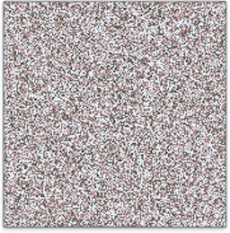  
[[scratchapixel]](https://www.scratchapixel.com/lessons/procedural-generation-virtual-worlds)

--

We want small variations locally and large variations globally.

---
.header[Procedural Noise]

## Requirements For Procedural Noise

For good noise functions there are overall the following requirements.

* Spatial correlation

???
.task[COMMENT:]  

* Minimal location shifts should not result in huge value differences, creating a smooth behavior. This means that local value changes are gradual, while global changes can be large.

--
*  No Periodicity

???
.task[COMMENT:]  

* At least, we do not want to see it.

---
.header[Procedural Noise]

## Requirements For Procedural Noise

For good noise functions there are overall the following requirements.

* Spatial correlation
*  No Periodicity

  

---
.header[Procedural Noise]

## Requirements For Procedural Noise

For good noise functions there are overall the following requirements.

* Spatial correlation
* No Periodicity
* A Defined Distribution

???
.task[COMMENT:]  

* We want some control over the function, e.g. how smooth it is.

--
* Reproducibility

???
.task[COMMENT:]  

* The noise should look the same every time we compute is, e.g. in every frame we render unless we explicitly want a change e.g. for an animation.

---

## Noise Function Designs

  
[[scratchapixel]](https://www.scratchapixel.com/lessons/procedural-generation-virtual-worlds/procedural-patterns-noise-part-1/creating-simple-1D-noise)

    y = rng(x) 
vs. 

    y = noise(x)
---
.header[Noise Function Designs]

## (Lattice) Value Noise

* A fixed grid (the *lattice*)
    * Relates the noise to space
    * Defines the basic scale
* A random number for each grid point
* Interpolate in-between
    * Again, many interpolation algorithms available
    * Ensures spatial correlation


---
.header[Noise Function Designs]

## (Lattice) Gradient Noise

.center[[[scratchapixel]](https://www.scratchapixel.com/lessons/procedural-generation-virtual-worlds/perlin-noise-part-2)]

Through the use of random vectors, the distribution of frequencies in the Perlin noise is more regular than the value noise's frequency spectrum.

???
.task[COMMENT:]  

* To get uneven frequency changes under control, we can define random normalized gradients, meaning random vectors, on a grid for each sample point instead of simply using values. Then, we interpolate a smooth function between those vectors.
* This causes the curve to go up on one side of the lattice point and down on the other side of that same point such as
* The worst case in regard to a uneven frequency distribution happens when two successive lattice points have gradients that aim at opposite directions (one points up and the other points down). Then the noise function will have a "S" like shape between the two points.

---
.header[Noise Function Designs]

## (Lattice) Gradient Noise

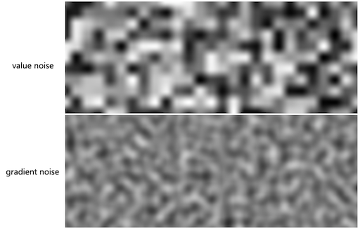  
[[iquilezles]](http://www.iquilezles.org/)


???
.task[COMMENT:]  

* Through the use of random vectors, the distribution of frequencies in the Perlin noise is more regular than the value noise's frequency spectrum.


---
.header[Noise Function Designs]


## `noise()`

In almost all environments we are using you have pre-defined noise functions such as 

```glsl
// 1D
noise(x); 

//2D
noise(x, y);
```


```glsl
value = amplitude * noise(frequency * x + offset);
```


???
.task[COMMENT:]  

* For full control over your results, check which algorithm the `noise()` function is based and whether the noise creates the distribution you want. If not you can always go back to defining your own noise function. 


---
## Component Frequencies

.center[[[thebookofshaders]](https://thebookofshaders.com/11/)]


???
.task[COMMENT:]  

* In the above example we can observe well that organic patterns have *multiple levels* of detail with self-similar structures.

---
## Component Frequencies

To represent this, we can sum up multiple noise functions (so-called *octaves*) at different frequencies and amplitudes.

.center[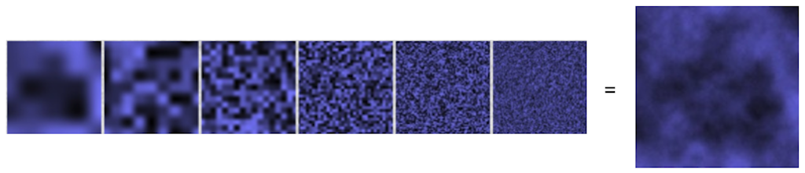[[hugo.elias]](https://web.archive.org/web/20150316212611/http://freespace.virgin.net/hugo.elias/models/m_perlin.htm)]

Approaches define a relationship between frequency and amplitude and successive octaves.

Such noises are for example Turbulent noise, Fractal Brownian Motion (fBM), Fractal noise or Multi-Octave noise.

???
.task[COMMENT:]  

* The represent this, we remember the insights we gained from Fourier transformations and that any function, or signal, can be decomposed into simple component signals at different frequencies.


---
.header[Component Frequencies]

## Perlin’s Turbulence Noise


Hence, the levels are


 [[2]]()


???
.task[COMMENT:]  

* *On a side note:* Turbulent noise is often considered as Perlin noise. This is not true. Perlin’s main contribution is the noise function itself. He used in his paper a specific turbulent noise setup as an example application for his noise function. But the internet doesn't understand this.
* This type of turbulence noise is also known as Fractal Brownian Motion (fBM) or Fractal Noise.

For example, Inigo Quiles applied fbm noise to wrap the space of a fbm noise again with the following results:

  
[[Warping by Iq]](https://www.shadertoy.com/view/4s23zz)

If you want to understand this better, Inigo also wrote [an article](https://www.iquilezles.org/www/articles/warp/warp.htm) about it.

---
## Worley Noise

  


   
[[thebookofshaders]](https://thebookofshaders.com/12/)


???
.task[COMMENT:]  

* Worley noise is based on a distance field, for which you compute for each pixel the distance to a set of points. 
* This set of points are often randomly distributed feature points. Then, we take the closest distance to all points found and use that as color information, e.g. black and white.
* Steven Worley. 1996. A cellular texture basis function. In Proceedings of the 23rd annual conference on Computer graphics and interactive techniques (SIGGRAPH '96). ACM, New York, NY, USA, 291-294.


---
## Voronoi Algorithm

 [[wiki]](https://en.wikipedia.org/wiki/Voronoi_diagram#/media/File:Euclidean_Voronoi_diagram.svg)

A Voronoi diagram has the following characteristics:

* Partitioning of a plane into *n* convex polygons (aka cells or regions).
* Each point in a region is guaranteed to be closer to the region’s generating point than any of the other *n* possible generating points.
* Line segments are equidistant to two points. Nodes (corners) are equidistant to three (or more) points.

???
.task[COMMENT:]  

* A Voronoi diagram is a slight variation from the Worley noise in the sense that is doesn't save the closest distance for each pixel to a feature point, but it saves for each pixel the feature point itself, e.g. by assigning the color of the closest point, disregarding the actual distance. 
  
* We are free to define any kind of distance. So far we have used the most common one, the *Euclidian distance*.
* Euclidean distance, Manhattan distance and Chebyshev distance are all distance metrics which compute a number based on two data points. All the three metrics are useful in various use cases and differ in some important aspects which we bring out in this article. 

---

## Noise in Houdini

There are several different generation approaches in Houdini.

.center[
[[sidefx]](https://vimeo.com/75313908)]


---
template: inverse

# Homework

---
## Homework

### Task 05.01 - Collecting Inspiration

### Task 05.02 - A Fancy Noise Material in Unreal


---
template: inverse

# Chapter 07 - Dynamics

---
layout: false

## Animation


???
.task[COMMENT:]  


*Animation* comes from the Latin *animatus*, the past participle of *animare*, meaning *to give life to*. *Animare* comes from the Latin word *anima*, meaning *breath* or *soul*. From *anima* comes, among other words, also *animal* for example. A characteristic of animals is their ability to move. When a cartoon is drawn and filmed in such a way that lifelike movement is produced, it is animated. An animated film seems to have a life of its own.
* For visual properties, animation can be understood as the depiction of spatially and temporally varying structures and behavior. You can animate the position of an object, its form and Gestalt and also its environment with e.g. animating lights and cameras.

--

[](https://www.youtube.com/watch?v=VTNmLt7QX8E) [[ajp, Heider and Simmel]](https://doi.org/10.2307%2F1416950)


???
.task[COMMENT:]  

* https://www.youtube.com/watch?v=8FIEZXMUM2I

--

Movement is one of, if not the most crucial aspect, for humans to assign liveness to objects!

???
.task[COMMENT:]  

* explores with which sentiments the animation of simple geometric objects is perceived.
* Which story does unfold here?

---
## Animation


???
.task[COMMENT:]  

* what are the two main principles to animate objects?

--

* Keyframe animation

???
.task[COMMENT:]  

* You can define an animation explicitly, meaning you tell each object precisely where to go. 
* Direct / Inverse kinematic? *geometry of motion*
    * A kinematics problem begins by describing the geometry of the system and declaring all initial conditions of any known values within the system such as of the position. Then, any unknown parts of the system, such as the position in the next frame can be derived from the geometry of the system.
    * Path animation
    * There are two types of indirect kinematic animation, namely *forward kinematics* and *inverse kinematics*.
--
* Dynamic systems

???
.task[COMMENT:]  

* This constitutes a *physically motivated animation* and implements how *forces* act on masses.
* As part of a dynamic system, objects can have influencing properties such as a mass or agency, but overall they do not know where to go next but mainly react to their environment.


---
template:inverse

#  Keyframe Animation

---
##  Keyframe Animation

A keyframe in traditional animation is a drawing that defines the starting and ending points of any smooth transition.  

A sequence of keyframes defines an overall movement. 


???
.task[COMMENT:]  

* The drawings are called *frames* because their position in time were measured in frames on a strip of film.
* Keyframes have the advantage that they give direct control to the animator.

---
##  Keyframe Animation

  
[[script-tutorials]](https://www.script-tutorials.com/css-animation-guide-for-novices/)

To create a smooth and fluent animation the remaining frames are filled with *inbetweens*. 


???
.task[COMMENT:]  

* Once again, there are different interpolation formulas, which are crucial for the final look.
* If you want to know how to set keyframes in Houdini, check out this 2 minutes [video](https://vimeo.com/116173730). The most important tool to work with keyframes is the Graph Editor or [Graph View](https://www.sidefx.com/docs/houdini/ref/panes/changraph.html), which exists in some form or the other in all 3D animation packages.
* Keyframe animation is truly an art in itself. It takes practice and overall a lot of time and effort. To me personally it has always been the hardest aspect of doing 3D. I think, I have just no eye for it, I only know when it is wrong but I have no understanding and intuition about what to change to make it right. I have spent countless hours with practicing to animate walk cycles, with very disappointing results. Why am I telling you this? Because I want you to internalize to never underestimate what it takes to create a keyframe animation in regard to time, effort and experience. Ideally, have an expert around to do it for you!

---
## Kinematic Animation

--

The *geometry of motion*.  

--

* Describe the geometry of the system and all initial conditions
* Any unknown parts of the system, such as the next position, can be derived from the geometry of the system.  

???
.task[COMMENT:]  

* A kinematics problem begins by describing the geometry of the system and declaring all initial conditions of any known values within the system such as of the position. 
* Then, any unknown parts of the system, such as the position in the next frame can be derived from the geometry of the system. 
  
---
.header[Kinematic Animation]

## Direct Kinematic Animation
  
  
[[coherent-labs]](https://coherent-labs.com/posts/create-motion-path-animation-animate/)

E.g. path animation is an example for *direct kinematic animation*.


???
.task[COMMENT:]  

*  For path animation an object follows a specified path from control points. Aspects to look out for are the orientation of the object and whether velocity control, meaning slow-in/slow-outs, are needed.  
*  In Houdini this is done with the [](http://www.sidefx.com/docs/houdini/shelf/constraintpath.html)

[[3]](https://en.wikipedia.org/wiki/Kinematics)  

---
.header[Kinematic Animation]

## Indirect Kinematic Animation

Objects derive their movement from the movement of other objects,  
  
--
e.g. with a hierarchy of joints. 

.center[]  
[[wiki]](https://en.wikipedia.org/wiki/Inverse_kinematics#/media/File:Modele_cinematique_corps_humain.svg)


???
.task[COMMENT:]  

* For indirect kinematic animation there is no direct information such as a path for certain object of the scene, but these objects derive their movement from the movement of other objects, e.g. with a hierarchy of joints. 
  
--

There are two types of indirect kinematic animation, namely *forward kinematics* and *inverse kinematics*.

---
.header[Kinematic Animation | Indirect Kinematics]

## Forward Kinematic Animation

--

We are moving the joints (e.g. from an arm) and get back a position and a orientation in scene space (e.g. for a hand).

.center[]
[[generationrobots]](https://www.generationrobots.com/de/403512-roboterarm-reactorx-200.html)   
  
--
  
*The joints in green are rotated and the postion of the hand is moved by that.*


???
.task[COMMENT:]  

* For forward kinematics we map the space of the joints to the cartesian space of the scene.
* 

---
.header[Kinematic Animation | Indirect Kinematics]

## Inverse Kinematic Animation

--

We are moving a target handle, also called the *end effector* (e.g. a hand) and from that the orientation of the joints (e.g. for an arm) is derived. 

.center[]  
[[generationrobots]](https://www.generationrobots.com/de/403512-roboterarm-reactorx-200.html)  
  
--
  
*The handle in green is moved in space and the rotation of the joint is computed from that.*

???
.task[COMMENT:]  

* For inverse kinematic, it is the other way around. We are mapping the cartesian space of the scene to the space of the joints.
* The addition of constraints, limits, collision detections, etc. play a crucial part in inverse kinematic. E.g when building a human leg system, you want to make sure that you can rotate the knee joints only about 135° in the direction of the back of the leg.

---
.header[Kinematic Animation | Indirect Kinematics]

## Inverse Kinematic Animation

.center[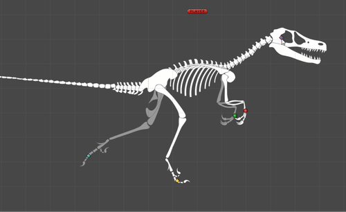]
[[grandscratchybluetonguelizard]](https://gfycat.com/grandscratchybluetonguelizard) *An inverse Kinematic setup.*


???
.task[COMMENT:]  

* The addition of constraints, limits, collision detections, etc. play a crucial part in inverse kinematic. E.g when building a human leg system, you want to make sure that you can rotate the knee joints only about 135° in the direction of the back of the leg.
* Now, onwards to the topic we are actually interested in: moving suff without lifting a finger. Or something like that. Well, at least without creating a zillion keyframes...


---
template:inverse

# Dynamics


---
## Dynamics

--

A dynamic system computes the motion of masses under the influence of *forces*.


???
.task[COMMENT:]  

* Why do we use dynamics systems for particle setups?
    * Particle systems are easily made of thousands of particles and most sane people would not want to set keyframes for every single particle.

---
.header[Dynamics]

## Forces


???
.task[COMMENT:]  

* Intuitively, the application of a force can be described as a *push* or a *pull*.

--

A force is any interaction that, when unopposed, will change the motion of an object.  

--

A force has potentially both *magnitude* and *direction*, making it a vector.

--

> How can a *force* change the location of an object?


???
.task[COMMENT:]  

* **This now the question we want to answer**
* For using the magic of forces, we first have to dig into some mathematical backgrounds
* A force can cause an object with mass to change its *velocity* (which includes to begin moving from a state of rest), that is to *accelerate*.

---
template:inverse

# Mathematical Basics


???
.task[COMMENT:]  

* We are now going through the math that is needed to compute how a force changes the location of an object. For that we start the other way around, by investigating first what is happening when we change the location of an object.

---
.header[Mathematical Basics]

## Velocity

--


???
.task[COMMENT:]  

* Let's say we want to get from **a** to **b**. For that we add a vector to **a**, which moves it to **b**.

--

The *velocity* vector (*Geschwindigkeit*) is telling us where to go.  

--

> The velocity of an object is the *rate of change of its location* and it is a function of time.


???
.task[COMMENT:]  

* Velocity is equivalent to a specification of an object's speed and direction of motion (e.g. 60 km/h to the north)
* In short, velocity is a *rate of change*.

---
.header[Mathematical Basics]

## Calculus


Computations in regard to moving objects and changing locations are part of *[Calculus](https://en.wikipedia.org/wiki/Calculus)*.  


???
.task[COMMENT:]  

* *the study of change*

--
  
> Calculus is the mathematical study of change, in the same way that Geometry is the study of shape, and Algebra is the study of operations and their application to solving equations. [[5]](https://books.google.de/books?id=-WC_AAAAQBAJ&printsec=frontcover&hl=de&source=gbs_ge_summary_r&cad=0#v=onepage&q&f=false)

---
.header[Mathematical Basics | Velocity]

## Slope

In mathematical terms, the velocity to move from one point to another can be described as slope **m**.

--

.center[]

The symbol Δ (Delta) is an abbreviation for *change in*.

???
.task[COMMENT:]  

* Slope is a value that describes the **steepness and direction of a line**. 
* In variable format, it is commonly represented by the letter m. 
* **The slope of a line is also called its gradient or rate of change.**
* y = mx + b where:
    * m is the slope or gradient of the line.
    * b is the y-intercept of the line.
    * x is the independent variable of the function y = f(x).

---
.header[Mathematical Basics | Velocity]

## Slope

.center[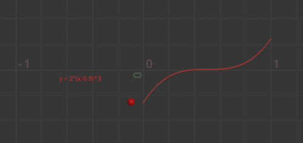 [[6]](https://entagma.com/particles-part-03-the-principle-of-particle-simulation/)] 


???
.task[COMMENT:]  

* Similarly, imagine we are animating the position of one red particle in y, based on the formula *y = 2(t-0.5)^3*. We can visualize the particle's movement in regard to the time in x.

--

The velocity changes over time...

---
.header[Mathematical Basics | Velocity]

## Slope

.center[ [[6]](https://entagma.com/particles-part-03-the-principle-of-particle-simulation/)] 

--

We need to be able to compute the slope at a single point.

---
.header[Mathematical Basics | Velocity]

## Slope

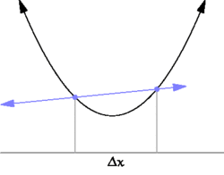  
[[wiki]](https://en.wikipedia.org/wiki/Derivative)


???
.task[COMMENT:]  

* For that, we shrink the difference to the neighboring point towards zero

--

  
[[wiki]](https://en.wikipedia.org/wiki/Derivative)

---
.header[Mathematical Basics | Velocity]

## Differentiation

--

*Differentiation* is a method to find an *exact value for the slope*, hence the rate of change at any given time t. 

--

> The first derivative of the function *y = f(t)* is a measure of the rate at which the value *y* of the function changes with respect to the change of the time *t*.


???
.task[COMMENT:]  

* This means in our context the first derivative of the function *y = f(t)* is a measure of the rate of change.

---
.header[Mathematical Basics | Velocity]

## Differentiation


.center[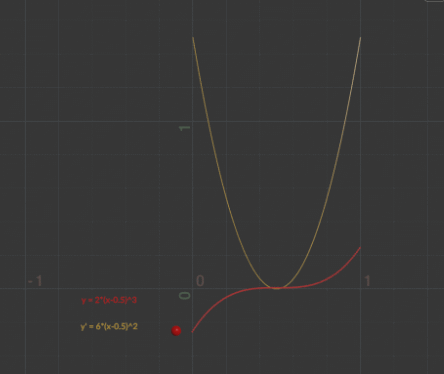 [[6]](https://entagma.com/particles-part-03-the-principle-of-particle-simulation/)] 


???
.task[COMMENT:]  

* The first derivative of the function y = f(t) is a measure of the rate at which the value y of the function changes with respect to the change of the time t.
* For many functions there are [differentiation rules](https://en.wikipedia.org/wiki/Differentiation_rules) to find a function's derivatives such as analytical solution in yellow shown above. If an analytical solution (meaning to calculate the exact solution by well-defined steps, such as the rules to derivate a function statement) is not possible, numerical approximations are used instead. We will come back to that.
* y = 2(t-0.5)^3 => 6*(t-0.5)^2


---
.header[Mathematical Basics]

## Velocity

In summary:

> Velocity measures the change in location over a certain time. Therefore, velocity can be described as the first derivative of location.


???
.task[COMMENT:]  

* To have a *constant* velocity, an object must have a constant speed in a constant direction. 

---
.header[Mathematical Basics]

## Acceleration

--

If there is a change in speed, direction or both, then the object has a changing velocity and is said to be undergoing an *acceleration* (*Beschleunigung*). 


???
.task[COMMENT:]  

* For example, a car moving at a constant 20 kilometers per hour in a circular path has a constant speed, but does not have a constant velocity because its direction changes. Hence, the car is considered to be undergoing an acceleration.

--

> Acceleration measures the the change in velocity over a certain time. Therefore, acceleration can be described as the first derivative of velocity and the second derivative of location.

---
.header[Mathematical Basics]

## Acceleration

.center[[[6]](https://entagma.com/particles-part-03-the-principle-of-particle-simulation/)]


???
.task[COMMENT:]  

* Again, we can easily plot the analytical solution of the derivative of the velocity of the particle, or the second derivative of the location, hence its acceleration (in blue)
* * y = 2(t-0.5)^3 => 6*(t-0.5)^2 => 12t-6

---
## Mathematical Basics

In summary

--
* Velocity measures the change in location over a certain time.

--
* Acceleration measures the change in velocity over time.  
  
--
  
If we want to compute a new location for a point **p** over time t, we apply its velocity **v** and acceleration **a**:

--

**v'** = **v** + **a** · **Δt**  
**p'** = **p** + **v'** · **Δt**  

--

> How can a *force* change the location of an object?


???
.task[COMMENT:]  

* Well, that is all fun and games but didn't we want to figure out how a *force* changes the location of an object? Remember that we earlier learned that a force is a vector that causes an object with mass to *accelerate*. To accelerate, acceleration...? It seems like we are getting closer. But first, some more background theory 😁! 

---
template:inverse

## Newton’s Laws of Motion


---

## Newton’s Laws of Motion

1. An object at rest stays at rest and an object in motion stays in motion.
2. ...
3. For every action there is an equal and opposite reaction.


???
.task[COMMENT:]  

* 1.:...for a constant speed and direction - as we already know! A force will mix things up. For example, a ball tossed in the earth’s atmosphere slows down because of the air resistance, which is a force.
* 3.: This law is a bit tricky to understand. The third law states that all forces between two objects exist in equal magnitude and opposite direction: if one object A exerts a force **F**<sub>A</sub> on a second object B, then B simultaneously exerts a force **F**<sub>B</sub> on A, and the two forces are equal in magnitude and opposite in direction: **F**<sub>A</sub> = −**F**<sub>B</sub> [29, as cited in [8]]. The third law means that all forces are interactions between different bodies [30, 31, as cited in [8]] and thus that there is no such thing as a force that is not accompanied by an equal and opposite force. This law is sometimes referred to as the *action-reaction law*, with one force called the *action* and the other one as the *reaction*.  
* From a conceptual standpoint, Newton's third law is seen when a person walks: they push against the floor, and the floor pushes against the person. In swimming, a person interacts with the water, pushing the water backward, while the water simultaneously pushes the person forward — both the person and the water push against each other. The reaction forces account for the motion in these examples. These forces depend on friction; a person or car on ice, for example, may be unable to exert the action force to produce the needed reaction force to move [32, as cited in [8]].
* The good news is that in computer graphics we don't have to stay true to physics but only need to model the perceived visual results of the law such as a character walking.


---
## Newton’s Second Law of Motion

--

> Force equals mass times acceleration, hence **F** = **M** · **A**.  

With **F** as force, **M** as mass and **A** as acceleration.


???
.task[COMMENT:]  

* Why is this exciting? Well, now we have a formula that directly ties a force to acceleration, which we had already tied to a change of location, meaning, moving stuff. 
* The law says that acceleration is directly proportional to force and that acceleration is inversely proportional to mass. This means if you get pushed, the harder you are pushed, the faster you’ll move (or accelerate) and the bigger you are, the slower you’ll move!
    * The *mass* of an object is a measure of the amount of matter in the object (measured in kilograms).
    * *Weight*, though often mistaken for mass, is technically the force of gravity on an object. From Newton’s second law, we can calculate it as mass times the acceleration of gravity (w = m * g). Weight is measured in newtons.
    * *Density* is defined as the amount of mass per unit of volume (grams per cubic centimeter, for example).
    * An object that has a *mass* of one kilogram on earth and would have a *mass* of one kilogram on the moon. However, it would *weight* only one-sixth as much.

--


???
.task[COMMENT:]  

* We can also now express acceleration simply as..
* Once again, let's keep in mind that we work with a pretend pixel world. If we want to, objects can have a mass equal to 1.

--

If we want to, objects can have a mass equal to 1. Then we have **A** = **F**, meaning that the acceleration of an object is equal to the force applied. 

--

Also, more precisely: *the net force equals mass times acceleration*, meaning that acceleration is equal to the *sum of all forces* divided by mass.


???
.task[COMMENT:]  

* If we have more than one force such as gravity and wind, we refer to a more precise formulation of the second law as *the net force equals mass times acceleration*, meaning in turn that acceleration is equal to the *sum of all forces* divided by mass.

---
## Newton’s Second Law of Motion

> How can a *force* change the location of an object?


???
.task[COMMENT:]  

* Ok, now. Back to the question: how does a force change the location of an object? We know that with a mass of one, the force equals the acceleration of the object. 

--

**v'** = **v** + **F** · **Δt**  
**p'** = **p** + **v'** · **Δt**  

Force equals acceleration.  

--

But how do we get from force or acceleration values to a velocity value?

--

...with acceleration being the derivative of velocity?!


???
.task[COMMENT:]  

* So, we start with the force or acceleration and want to compute the velocity and location from that.
* Seems like we somehow need to go the steps we took to get from location to acceleration the other way around.  
  
*What is this other way around?*    
*What is the inverse of a derivation?*

--

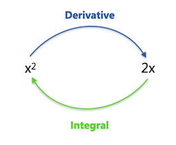


???
.task[COMMENT:]  

* The inverse of derivation is integration


---
## Mathematical Basics

The integral of the object’s acceleration over time tells us the velocity when that time period ends.
  

--

And the integral of an object’s velocity over time tells us the object’s new location when that time period ends.


???
.task[COMMENT:]  

* Imagine integration like filling a tank from a tap. The input (before integration) is the flow rate from the tap (velocity). Integrating the flow (adding up all the little bits of water) gives us the volume of water (new location) in the tank. Imagine the flow starts at 0 and gradually increases (maybe a motor is slowly opening the tap). As the flow rate increases, the tank fills up faster and faster. With a flow rate of 2x, the tank fills up at x<sup>2</sup>. We have integrated the flow to get the volume. [[9]](https://www.mathsisfun.com/calculus/integration-introduction.html)  

---
## Mathematical Basics

In summary

.center[
**v'** = **v** + **a** · **Δt**  
**p'** = **p** + **v'** · **Δt**]
  
--
  
with

* acceleration as the sum of all forces divided by mass

--
* velocity as the integral of acceleration, and

--
* location as the integral of velocity.

--

> In short, in a dynamic system we define forces, these forces create acceleration, from these we compute the velocity and from that the location.

--

As dynamic forces might change over time, we need to integrate repeatedly in certain time steps for detecting any changes of the force.

???
.task[COMMENT:]  

*  Hence, at each time step we compute the force, add it to the velocity and add the velocity to the location. 

---
.header[Forces]

## Integration

.center[]  
[[6]](https://entagma.com/particles-part-03-the-principle-of-particle-simulation/)


???
.task[COMMENT:]  

* So, we are in the situation that we want to integrate the acceleration function (blue) to get the velocity function (yellow). Then, we want to integrate the velocity function to get the location function (red) and with that the location of the object that is moved by a force.
* Remember, the acceleration function (blue) is defined by the rate of change of the velocity function (yellow). This rate of change is also described by the slope at a certain point of the yellow velocity graph.

---
.header[Forces]

## Integration

How to integrate really depends on the scenario.  
  
More often, an analytical solution is not possible and we need an approximation.


???
.task[COMMENT:]  

*  Additionally, we might not be able to solve the integral analytically, as it is very likely that a system e.g. of many particles and forces is too complex for that
* We can approximate the analytical solution with numerical integration, which also requires to make small steps over time. A method, which is also called the method of small steps is the Euler method.

---
.header[Forces | Integration]

## Euler Integration


???
.task[COMMENT:]  

* Now, instead of integrating the acceleration function (because we don't know how), we can approximate the velocity function by following its slope in small time steps. 

--

One way is to approximate the velocity function by following its slope in small time steps. This is the principle of Euler integration.

--

> From any point on a curve, you can find an approximation of a nearby point on the curve by moving a short distance along a line tangent to the curve.

.center[]


???
.task[COMMENT:]  

* We start at an initial condition, e.g. zero and travel a small step along the line of the slope (the line tangent to that point) and add that velocity to the initial velocity. Then we travel on the tangent of that point a small step, finding the next velocity, and again and again. This is called Euler Integration.

--


The smaller the time-steps the smoother the integration. However smaller steps might lead to performance issues.


???
.task[COMMENT:]  

* There are a number of different numerical integration methods, such as [Verlet Integration](https://en.wikipedia.org/wiki/Verlet_integration) or the famous [Runge-Kutta Integration](https://en.wikipedia.org/wiki/Runge%E2%80%93Kutta_methods). These methods are mathematically more complex but potentially more accurate and / or more efficient. Most of the time Euler integration is good enough and has the advantage of being fast.
* For computing a dynamic system, e.g. a particle simulation, we start with the forces, the forces create acceleration, the acceleration is integrated to find the velocity and the velocity is integrated again to find the location. That location is then assigned to the moving element / particle.

Or:

**v'** = **v** + **a** · **Δt**  
**p'** = **p** + **v'** · **Δt**  

---
template:inverse

# Creating Forces

---

## Creating Forces

A force is just a vector. 

--

We need to divide the force by the object's mass and add it to the object’s acceleration vector.

--

*But how do we get such a force vector?*

--
* Make up a force

???
.task[COMMENT:]  

* Well, there are several ways. For one, we can simply make one up for our make-believe pixel worlds (e.g. we do so in the exercise) 🎉.  

--
* Model a force according to physics of the real world

???
.task[COMMENT:]  

* For this we need to look up their defining formulas and translate them into source code. 
* I would like to guide you through one example for this, as this is a really good exercise to become more familiar with scary looking formulas, which are not scary at all, once you have a closer look.
* Such existing forces include for example gravity, electromagnetism, friction, tension, elasticity, etc. Now, we want to model a force according to physics of the real world but of course there is still quite some flexibility for our purposes. For which characteristics we are flexible depends on the force and the context. But as always with coding you can just decide on this with testing different values and trail & error (my favorite approach 🙃).

---
.header[Creating Forces]

## Physically-Based Forces

When we look up a formula, we always follow the same principle for working with any force, namely that we need to deconstruct the force’s formula into two parts:

--
1. How do we compute the force’s *direction*?

--
2. How do we compute the force’s *magnitude*?


???
.task[COMMENT:]  

* Always keep in mind that forces usually highly depend on the existing velocity of the object we want to apply the force to. So most of the time you need to integrate the object's velocity into the formula of a force. Also, it is always helpful to really understand the overall concept behind a force. What does e.g. tension mean? How does the effect look like? What do we want to do with it?  

---
.header[Creating Forces | Physically-Based Forces]

### Example Air and Fluid Resistance

Friction occurs when a body passes through a liquid or gas.  

  
[[codingtrain]](https://editor.p5js.org/codingtrain/sketches/5V8nSBOS)  

--

This force is called a *drag force*.  


---
.header[Creating Forces | Physically-Based Forces]

### Example Air and Fluid Resistance

The same force models air resistance for a plane:

.center[]  
[[natureofcode]](http://natureofcode.com/book/chapter-1-vectors/)  

---
.header[Creating Forces | Physically-Based Forces]

### Example Air and Fluid Resistance

A textbook, meaning wikipedia, gives you the formula for a drag force as

--

  

where

* F<sub>D</sub> is the drag force,
* 𝞺 (rho) is the density of the fluid,
* *v* is the speed of the object,
* A is the cross sectional area, and
* C<sub>D</sub> is the drag coefficient.


???
.task[COMMENT:]  

*  [wikipedia](https://en.wikipedia.org/wiki/Drag_(physics))
*  Ok, let's understand that better.

---
.header[Creating Forces | Physically-Based Forces]

### Example Air and Fluid Resistance

  

What can we understand about the force's **direction** and **magnitude**? 

--

* We have a magnitude with *v* as the current speed of the object, meaning the magnitude of the object's velocity.

???
.task[COMMENT:]  

* Velocity is equivalent to a specification of an object's speed and direction of motion (e.g. 60 km/h to the north)
  
--
* There is no direction. This means that the drag force doesn't change the objects direction.

???
.task[COMMENT:]  

* Turning our brains on, we figure out that this mean we have to use the opposite direction of the object's current velocity vector! But we don't want to interfere with the formula with the incoming velocity magnitude (after all the formula comes with its own speed information). Hence, to have a direction, we multiply the formula with the inverse of the incoming unit velocity vector v̂, meaning it has the length of one, only giving us information about the velocity's direction.
  
--
   
However, we always need to have a direction to apply a force.

--
* The balls slow down and the F<sub>D</sub> is *facing* the airplane

???
.task[COMMENT:]  

* Turning our brains on, we figure out that this mean we have to use the opposite direction of the object's current velocity vector !
  
--
* We use the inverse of the incoming unit velocity vector v̂

???
.task[COMMENT:]  

* But we don't want to interfere with the formula with the incoming velocity magnitude (after all the formula comes with its own speed information). Hence, to have a direction, we multiply the formula with the inverse of the incoming unit velocity vector v̂, meaning it has the length of one, only giving us information about the velocity's direction.
* Ok, now that we have an overall understanding of the force, let's decipher the formula step by step, shall we?

---
.header[Creating Forces | Physically-Based Forces]

### Example Air and Fluid Resistance

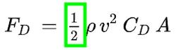  

* Irrelevant for our make-believe world


???
.task[COMMENT:]  

* Factors like that are usually irrelevant for our make-believe worlds as we can set our own values anyways (we are not limited matching e.g. other constants given by nature). Hence, we simply ignore this.

---
.header[Creating Forces | Physically-Based Forces]

### Example Air and Fluid Resistance

  

* Set it to a constant value of 1
    * As long as it is not changing over time


???
.task[COMMENT:]  

* As wikipedia tells us, this is the density of the liquid. This is also something we normally don’t need to worry about as long as we don’t want to change it over time. We can simplify the problem and consider this to have a constant value of 1.

---
.header[Creating Forces | Physically-Based Forces]

### Example Air and Fluid Resistance

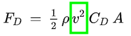  

* Magnitude of the incoming velocity vector, then squared


???
.task[COMMENT:]  

* We already identified this as the magnitude of the velocity vector (which is then squared), hence the speed of the object moving.

---
.header[Creating Forces | Physically-Based Forces]

### Example Air and Fluid Resistance

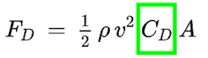  

* *C<sub>D</sub>* stands for the coefficient of drag. 
* This is the only constant we’ll keep to determine the strength of the drag force 
    * And by that also indirectly considering the 1/2 and 𝞺

---
.header[Creating Forces | Physically-Based Forces]

### Example Air and Fluid Resistance


  

* *A* stands for the frontal area of the object that is pushing through the liquid.
* The geometry of the area is usually simplified, e.g. with a sphere or bounding box.
* For a basic simulation, we can once again just ignore it.

---
.header[Creating Forces | Physically-Based Forces]

### Example Air and Fluid Resistance

With the steps taken above, now

  

reduces to

--
.center[] 


???
.task[COMMENT:]  

* magnitude is speed squared
* coefficient of drag
* direction is opposite of current velocity


---
.header[Creating Forces | Physically-Based Forces]

### Example Air and Fluid Resistance

```java
//https://natureofcode.com/book/chapter-2-forces/

void drag(Liquid l)
{
    float speed = velocity.mag();

    // magnitude
    float dragMagnitude = l.c * speed * speed; // The force’s magnitude: CD * v^2

    // direction
    PVector drag = velocity.get();
    drag.normalize();
    drag.mult(-1); // The force's direction: -1 * velocity
    

    // Putting mag and dir together
    drag.mult(dragMagnitude);

    // Apply the force.
    applyForce(drag);
}
...
void applyForce(PVector force)
{
    PVector f = PVector.div(force,mass);
    acceleration.add(f);
}
```


???
.task[COMMENT:]  

* [live demo in p5](https://editor.p5js.org/codingtrain/sketches/5V8nSBOS)
*  There is also a [video about the drag force](https://thecodingtrain.com/tracks/the-nature-of-code-2/noc/2-forces/4-drag-force) from him.  
*  You can also have a look at the  from Dan Shiffman and test different values for the drag coefficient.
* and a simple implementation in Processing could look like (I like this example for its clarity) the following

---
.header[Creating Forces | Physically-Based Forces]

### Example Air and Fluid Resistance

  
[[codingtrain]](https://editor.p5js.org/codingtrain/sketches/5V8nSBOS)  

--

*Why do the smaller objects slow more than the larger objects?*

--

In this implementation, the balls have a mass related to their size, meaning smaller balls have a smaller mass.


???
.task[COMMENT:]  

* The mass is considered in the example above by the line

```java
PVector f = PVector.div(force,mass);
```

* Newton’s second law says *A = F / M* 
* Hence, the smaller the mass, the higher the acceleration. 
* In this example, the smaller the mass, the stronger the force affects the object's movement.


???
.task[COMMENT:]  

* Back to our favorite insight of this chapter, Newton’s second law with *A = F / M*. Hence, we know that acceleration is inversely proportional to mass and with that we know that the smaller the mass, the higher the acceleration. In this example, we compute the force and use that as acceleration. This means that the smaller the mass, "the stronger the force" or better the stronger the force affects the object's movement.

---
## Creating Forces

If you are further interested in creating your own physically-based forces and working with them, I recommend [Chapter 2. Forces](https://natureofcode.com/book/chapter-2-forces/) in Dan's[ Nature of Code book](https://natureofcode.com/) and his [video series about forces](https://www.youtube.com/playlist?list=PLRqwX-V7Uu6ZV4yEcW3uDwOgGXKUUsPOM). 


---
template:inverse

## The End

# 👋🏻
