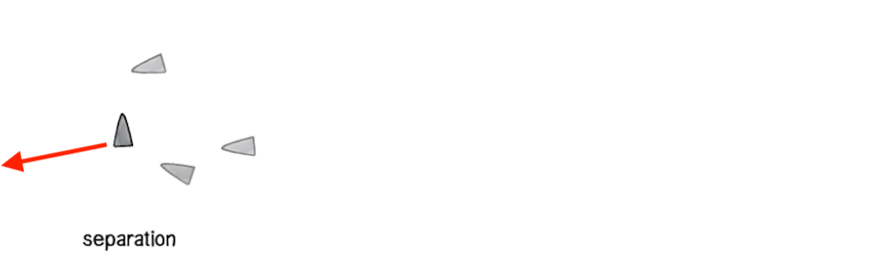

name: inverse
layout: true
class: center, middle, inverse
---


# Procedural Generation and Simulation

### Prof. Dr. Lena Gieseke | l.gieseke@filmuniversitaet.de  

#### Film University Babelsberg KONRAD WOLF

---
layout: false

## Today

* Recap of previous chapter 
* Particle Systems

---
## Today

.center[[[natureofcode]](https://natureofcode.com/book/chapter-6-autonomous-agents/)]


---
template: inverse

# Chapter 06 - Dynamics

---
layout: false

## Animation

[](https://www.youtube.com/watch?v=VTNmLt7QX8E) [[ajp, Heider and Simmel]](https://doi.org/10.2307%2F1416950)

Movement is one of, if not the most crucial aspect, for humans to assign liveness to objects!

???
.task[COMMENT:]  

* *Animation* comes from the Latin *animatus*, the past participle of *animare*, meaning *to give life to*. *Animare* comes from the Latin word *anima*, meaning *breath* or *soul*. From *anima* comes, among other words, also *animal* for example. A characteristic of animals is their ability to move. When a cartoon is drawn and filmed in such a way that lifelike movement is produced, it is animated. An animated film seems to have a life of its own. [[1]](https://www.merriam-webster.com/dictionary/animate)

---
## Animation

???
.task[COMMENT:]  

* what are the two main principles to animate objects?

--
* Keyframe animation
    * Manual placement of keyframes
    * Kinematic as the *geometry of motion*
        * Direct
        * Indirect
            * Forward
            * Backward
???
.task[COMMENT:]  

* You can define an animation explicitly, meaning you tell each object precisely where to go. 
* Direct / Inverse kinematic? *geometry of motion*
    * A kinematics problem begins by describing the geometry of the system and declaring all initial conditions of any known values within the system such as of the position. Then, any unknown parts of the system, such as the position in the next frame can be derived from the geometry of the system.
    * Path animation
    * There are two types of indirect kinematic animation, namely *forward kinematics* and *inverse kinematics*.
--
* Dynamic systems

???
.task[COMMENT:]  

* This constitutes a *physically motivated animation* and implements how *forces* act on masses.
* As part of a dynamic system, objects can have influencing properties such as a mass or agency, but overall they do not know where to go next but mainly react to their environment.

---
## Dynamics

--

A dynamic system computes the motion of masses under the influence of *forces*.


???
.task[COMMENT:]  

* Why do we use dynamics systems for particle setups?
    * Particle systems are easily made of thousands of particles and most sane people would not want to set keyframes for every single particle.

---
.header[Dynamics]

## Forces

A force is any interaction that, when unopposed, will change the motion of an object.  

--

A force has a *magnitude* and *direction*, making it a vector.

--

> How can a *force* change the location of an object?


???
.task[COMMENT:]  

* This now the question we want to answer
* A force can cause an object with mass to change its *velocity* (which includes to begin moving from a state of rest), that is to *accelerate*.

---
template:inverse

## Mathematical Basics

---
.header[Mathematical Basics]

## Velocity

--


The *velocity* vector (*Geschwindigkeit*) is telling us where to go. The velocity of an object is the *rate of change of its location* and it is a function of time.

> Velocity measures the change in location over a certain time. 


???
.task[COMMENT:]  

* Let's say we want to get from **a** to **b**. For that we add a vector to **a**, which moves it to **b**.
* Velocity is equivalent to a specification of an object's speed and direction of motion (e.g. 60 km/h to the north)
* In short, velocity is a *rate of change*.
* Therefore, velocity can be described as the first derivative of location.


---
.header[Mathematical Basics]

## Acceleration

--

If there is a change in speed, direction or both, then the object has a changing velocity and is said to be undergoing an *acceleration* (*Beschleunigung*). 

> Acceleration measures the the change in velocity over a certain time. 


???
.task[COMMENT:]  

* Therefore, acceleration can be described as the first derivative of velocity and the second derivative of location.


---
## Mathematical Basics

* Velocity measures the change in location over a certain time.
* Acceleration measures the change in velocity over time

If we want to compute a new location for a point **p** over time t, we apply its velocity **v** and acceleration **a**:

**v'** = **v** + **a** · **Δt**  
**p'** = **p** + **v'** · **Δt**  

--

> How can a *force* change the location of an object?

---
template:inverse

## Newton’s Second Law of Motion

---
## Newton’s Second Law of Motion

> Force equals mass times acceleration, hence **F** = **M** · **A**.  

With **F** as force, **M** as mass and **A** as acceleration.


???
.task[COMMENT:]  

* Well, now we have a formula that directly ties a force to acceleration, which we had already tied to a change of location, meaning, moving stuff. 
* The law says that acceleration is directly proportional to force and that acceleration is inversely proportional to mass. This means if you get pushed, the harder you are pushed, the faster you’ll move (or accelerate) and the bigger you are, the slower you’ll move!

--


???
.task[COMMENT:]  

* If we want to, objects can have a mass equal to 1. Then we have **F** = **A**, meaning that the acceleration of an object is equal to the force applied. 
* If we have more than one force such as gravity and wind, we refer to a more precise formulation of the second law as *the net force equals mass times acceleration*, meaning in turn that acceleration is equal to the *sum of all forces* divided by mass.

---
## Newton’s Second Law of Motion

> How can a *force* change the location of an object?

--

**v'** = **v** + **F** · **Δt**  
**p'** = **p** + **v'** · **Δt**  


Force equals acceleration.  

--


???
.task[COMMENT:]  

## Mathematical Basics


.center[[[6]](https://entagma.com/particles-part-03-the-principle-of-particle-simulation/)]

But how do we get from the force / acceleration value to a velocity value?


* *Differentiation* is a method to find an *exact value for the slope*, hence the rate of change at any given time t. 
* The first derivative of the function *y = f(t)* is a measure of the rate at which the value *y* of the function changes with respect to the change of the time *t*.
* This means in our context the first derivative of the function *y = f(t)* is a measure of the rate of change.
* The inverse of derivation is integration


.center[ ]


* *Differentiation* is a method to find an *exact value for the slope*, hence the rate of change at any given time t. 
* The first derivative of the function *y = f(t)* is a measure of the rate at which the value *y* of the function changes with respect to the change of the time *t*.
* This means in our context the first derivative of the function *y = f(t)* is a measure of the rate of change.
* The inverse of derivation is integration


.center[ ]


* The integral of the object’s acceleration over time tells us the velocity when that time period ends.

* The integral of an object’s velocity over time tells us the object’s new location when that time period ends.


---
## Forces

The integral of the object’s acceleration over time tells us the velocity when that time period ends. And the integral of an object’s velocity over time tells us the object’s new location when that time period ends.

**v'** = **v** + **a** · **Δt**  
**p'** = **p** + **v'** · **Δt**  

with

* acceleration as the sum of all forces divided by mass
* velocity as the integral of acceleration, and
* location as the integral of velocity.

> In short, in a dynamic system we define forces, these forces create acceleration, from these we compute the velocity and from that the location.


???
.task[COMMENT:]  


How to integrate really depends on the scenario. More often however, an analytical solution is not possible, but we need an approximation.

One way is to approximate the velocity function by following its slope in small time steps. This is the principle of Euler integration.

> From any point on a curve, you can find an approximation of a nearby point on the curve by moving a short distance along a line tangent to the curve.

.center[]


The smaller the time-steps the smoother the integration. However smaller steps might lead to performance issues.


* *Differentiation* is a method to find an *exact value for the slope*, hence the rate of change at any given time t (or in these graphs at any value of *x*). 


For computing a dynamic system, e.g. a particle simulation, 


* we start with the forces,
* the forces create acceleration, 
* the acceleration is integrated to find the velocity and
* the velocity is integrated again to find the location.
 
That location is then assigned to the moving element.
Or:

**v'** = **v** + **a** · **Δt**  
**p'** = **p** + **v'** · **Δt**  

---
template:inverse

# Particle Systems

---
## Particle Systems

The process of making the particles move is also called *simulation*.  


???
.task[COMMENT:]  

* I have already mentioned that with particles we almost always want to work with a dynamic system to make the particles move as we don't want to animate each particle manually.
* So what are we talking about here exactly?


--

> A particle system is a collection of many many minute particles that together represent a fuzzy object. Over a period of time, particles are generated into a system, move and change from within the system, and die from the system.  
  
— William Reeves, *Particle Systems—A Technique for Modeling a Class of Fuzzy Objects*, ACM Transactions on Graphics 2:2 (April 1983), 92.


???
.task[COMMENT:]  

* Reeves created [these particle effects](https://www.youtube.com/watch?v=zXFNypyMJCc) in the 80s as the first one to do so.


---
## Particle Systems

The process of making the particles move is also called *simulation*.  


> A particle system is a collection of **many many** minute particles that together represent a fuzzy object.** Over a period of time**, particles are generated into a system, **move** and **change** from within the system, and **die** from the system.  
  
— William Reeves, *Particle Systems—A Technique for Modeling a Class of Fuzzy Objects*, ACM Transactions on Graphics 2:2 (April 1983), 92.

???
.task[COMMENT:]  

* From this quote we can gather that we have a large amount of particles ("many many"), that time ("over a period of time") and movement ("move") matter and that there is some sort of lifecycle ("are generated" and "die").


---
## Particle Systems


Such systems of *many* things can 

--
* represent a variety of natural systems such as birds flocking, fish schooling, ecosystems evolving, etc., and

--
* model irregular types of natural phenomena auch as fire, smoke, waterfalls, fog, grass, bubbles, etc.


---
## Particle Systems

.center[]  
[[princeton.edu]](https://www.princeton.edu/news/2013/02/07/birds-feather-track-seven-neighbors-flock-together) *Flocks of birds.*

---
## Particle Systems

.center[]  
[[pinterest]](https://www.pinterest.de/pin/31243791139408749/) *A school of fish.*


???
.task[COMMENT:]  

* These systems are dynamics systems, often simulating based on insights from physics and based on Newton’s laws of motion about how to apply forces.

---
.header[Particle Systems]

## Setup

A single particle is an independent body that moves.

For building a system of moving particles, you need

--
1. A constructor initializing the system

--
2. Computation of acceleration, velocity and location for each particle

--
3. Application of the newly computed values


--
Step 2. and 3. are usually executed by your 3D environment. 


???
.task[COMMENT:]  

* We will use it in the exercise. If we were in Processing or p5 or such, we would also need to explicitly call a `display()` or render method for the particles in a fourth step.

---
.header[Particle Systems | Setup]

## Emitter

The source of the particles.

--
* A single burst of particles, a continuous stream of particles, or both  

--
* Controls the initial settings of the particles
  


???
.task[COMMENT:]  

* Such as their location, velocity, etc. 


---
.header[Particle Systems | Setup]

## Life Cycle

Old particles die of various possible reasons.

--
* Collision, running off screen, etc.  

--
  
Particles must have a well defined lifespan.

--
* Death after a certain amount of time, etc.


???
.task[COMMENT:]  

* In regard to life cycles make sure to actually delete the affected particles. For example (up to my current knowledge), when you work with Processing and objects wander off-screen they continue to exists as normal objects and are recomputed.

---
.header[Particle Systems]

## A System of Systems

A particle system is in itself an object. 

--
As such you can easily build a system of systems of systems of systems of systems...

.center[]

--

This principle relates to self-similar structures, fractals, turbulence noise, etc.


???
.task[COMMENT:]  

* We have already seen this principles in self-similar structures such as fractals or turbulence noise. But we can find this principle of *nesting* in all aspects of the world. E.g. an organ is a system of cells, a human body is a system of organs, a neighborhood is a system of human bodies, a city is a system of neighborhoods, and so own.

---
.header[Particle Systems]

## Complex Behavior   


???
.task[COMMENT:]  

* Ok, new line of thought: so far, when working with forces only, influences e.g. on the particles came only from the outside.
* *With which concepts could we extend a simulation for more complex behavior?*
* There are two approaches towards more complex behavior:

--

### 1. Autonomous Agents And Group Behaviors

* Agents not only react to e.g. forces but they also take certain actions themselves
* Often as a group behavior


???
.task[COMMENT:]  

* Autonomous agents not only react to e.g. forces but they also take certain actions themselves. Furthermore, we might want to create not just a single agent but a group of agents. For these we also might assign behavior to the group as whole. For grouping, agents need to know about the members of their group and adjust their specific behavior in regard to the group, e.g. when flocking and schooling.

--

.center[  [[science-junkies]](https://science-junkies.com/meet-the-swirlon-a-new-state-of-active-matter-discovered-by-physicists/17)]

---
.header[Particle Systems]

## Complex Behavior   

### 1. Autonomous Agents And Group Behaviors

* Agents not only react to e.g. forces but they also take certain actions themselves
* Often as a group behavior

.center[  [[david.li]](http://david.li/fluid/)]


???
.task[COMMENT:]  

* http://david.li/fluid/


---
.header[Particle Systems]

## Complex Behavior   

### 2. Soft Body Deformations

* System of connected particles

.center[]
 [[jklintan]](https://jklintan.github.io/html/cloth-simulation.html)


???
.task[COMMENT:]  

* https://jklintan.github.io/Cloth-Simulation/
* Certain appearances and deformations, such as fluids and cloths, are actually often modeled as a system of connected particles. These are topics that a quite complex and we will not dive deeper into them on a theoretical level.

---
.header[Particle Systems]

## Complex Behavior   

### 2. Soft Body Deformations

* System of connected particles

.center[]
 [[Gabriel-Zachmann]](https://www.researchgate.net/profile/Gabriel-Zachmann)


---
.header[Particle Systems]

## Autonomous Agents

Autonomous agents not only react to their environment but also take actions and make their own choices.  

--

This is called *agency*.

--

* fleeing
* wandering
* arriving
* pursuing
* evading
* ...

???
.task[COMMENT:]  

* which can be described as a *desire* to move. Such desires can be differentiated for example as fleeing, wandering, arriving, pursuing, evading, etc. depending how the movement is expressed. Often, with agents the goal to create live-like behavior and an impression of liveliness.

--

Often the goal is to create the impression of *liveliness*.

---
.header[Particle Systems | Autonomous Agents]

## Agency

Requires

--
* Knowledge of the environment

???
.task[COMMENT:]  

* Agency requires some knowledge of the environment. This can be anything, from having an understanding of the whole scene, to just recognizing the closest neighbor. Which knowledge we need to implement depends on the system and the behavior we want to create.

--
* Interactions between the elements 

???
.task[COMMENT:]  

or group behaviors we need to enable local interactions between the elements themselves.

--
* Computability

???
.task[COMMENT:]  


Agency, or the desire to move must be a *computable action*.

--

Agency as the application of *forces from within*.

???
.task[COMMENT:]  

Hence, we usually implement it in the same way we were working with forces and understand agency as the application of *forces from within*. 

--

.center[]
  


---
.header[Particle Systems | Autonomous Agents]

## Agents

Agents are nothing more than *smart particles*.  

--

In the context of agency, we usually call them *vehicles* or *agents*. 


???
.task[COMMENT:]  

* This is based on 

--

* Braitenberg, V. (1984). Vehicles, experiments in synthetic psychology. Cambridge, Mass.: MIT Press.
* Reynolds, C. W. (1999) [Steering Behaviors for Autonomous Characters](https://www.red3d.com/cwr/steer/), GDC proceedings, San Jose, Ca. Miller Freeman Game Group. Pages 763-782.

---
.header[Particle Systems | Autonomous Agents]

## Agents

As agency often includes to go in a certain direction an to make turn, agents are often visualized as slim triangles.

  

--

An agent's actions can be based on its own characteristics, on a goal, its environment or a combination of these aspects.


???
.task[COMMENT:]  

   Characteristics can be that the agent is slow or fast for example. Goals can be to seek, to flee, to follow a path, to follow a vector field, to flock with your neighbors, etc. The environment could slow an agent down for example, when the agent wants to move left but there is also heavy wind coming from the left.

--

*How would you express goals such as fleeing, wandering and seeking? What properties does an agent have that e.g. flees?*  

--
  
*How could you express characteristics such as love, fear, surprise, anger, etc.?*


???
.task[COMMENT:]  

* One of the simplest desires to move is the desire to move in a certain direction or towards an aim. This is implemented with a *steering force*.

---
.header[Particle Systems | Autonomous Agents]

## Example: Steering Force

An agent

* moves with a velocity,

???
.task[COMMENT:]  

* Imagine you have an agent that moves in a certain direction with a certain speed. But that vehicle has also the desire to move to a target,

--
* but also has the desire to move to a target,

???
.task[COMMENT:]  

*  hence it is *seeking* a target, such as the following example shows it (find the Processing code for all following examples in Dan's [Chapter 6. Autonomous Agents](https://natureofcode.com/book/chapter-6-autonomous-agents/)).

--
* hence, it is *seeking*.

--

.center[[[natureofcode]](https://natureofcode.com/book/chapter-6-autonomous-agents/)]


---
.header[Particle Systems | Autonomous Agents]

### Example: Steering Force

An agent

* moves with a velocity,
* but also has the desire to move to a target.


  
[[11]](https://natureofcode.com/book/chapter-6-autonomous-agents/)  


---
.header[Particle Systems | Autonomous Agents]

### Example: Steering Force

.center[]

---
.header[Particle Systems | Autonomous Agents]

### Example: Steering Force

.center[]

--

The desired velocity usually has a constant *maximum speed*, which is also called the *steering strength*.

---
.header[Particle Systems | Autonomous Agents]

### Example: Steering Force

.center[]

---
.header[Particle Systems | Autonomous Agents]

### Example: Steering Force

.center[]


???
.task[COMMENT:]  

* Here, the steering force is the difference between the desired velocity and the current velocity, as defined by Reynolds in *Steering Behaviors for Autonomous Characters*.

---
.header[Particle Systems | Autonomous Agents]

### Example: Steering Force


```bash
// Reynolds’s steering formula
steering force = desired velocity - current velocity
```

In Reynold's *Steering Behaviors for Autonomous Characters*.

--

You can understand this as a form of error correction and the difference between where I want to go and where I am currently going.

---
.header[Particle Systems | Autonomous Agents]

### Example: Steering Force


```java
void seek(PVector target)
{
    PVector desired = PVector.sub(target,location);
    desired.normalize();

    // Calculating the desired velocity
    // to target at max speed
    desired.mult(maxspeed);

    // Reynolds’s formula for steering force
    PVector steer = PVector.sub(desired,velocity);

    // Applying the force
    // to the object’s acceleration
    applyForce(steer);
}
```


---
.header[Particle Systems | Autonomous Agents]

### Example: Steering Force

For making it appear that the agent is slowly steering towards the target, you can also add a *maximum force* to limited the magnitude of the steering force.

.center[]
  
[[natureofcode]](https://natureofcode.com/book/chapter-6-autonomous-agents/)  

---
.header[Particle Systems | Autonomous Agents]

### Example: Steering Force

For making it appear that the agent is slowly steering towards the target, you can also add a *maximum force* to limited the magnitude of the steering force.

.center[]


--
```
steer.limit(maxforce);
```


???
.task[COMMENT:]  

* Depending on the behavior you want to archive, you might not want the agent to get to the target as fast as possible. If that were the case, we would just say “location equals target” and there the agent would be. Our goal, as Reynolds puts it, is to move the vehicle in a *lifelike and improvisational manner*.


---
.header[Particle Systems | Autonomous Agents]

### Example: Steering Force

*How would you convert this seeking behavior into a fleeing behavior?*


???
.task[COMMENT:]  

* Reverse the desired velocity force.

---
.header[Particle Systems | Autonomous Agents]

### Example: Steering Force

Reynolds suggests to slow down if we are a certain (small) distance from the target. 

.center[[[natureofcode]](https://natureofcode.com/book/chapter-6-autonomous-agents/)]
  
This supports the appearance of the agent that it knows and perceives its environment.

???
.task[COMMENT:]  

* To create even more live like behavior, often you want to create certain behavior when an agents comes closer to a target or arrives at a target. Reynolds suggests to slow down if we are a certain (small) distance from the target. This supports the appearance of the agent that it knows and perceives its environment.

---
.header[Particle Systems | Autonomous Agents]

### Example: Steering Force

For that, if the distance from the target is less than r, we map the range of zero to the desired speed and maximum speed to that distance.

.center[[[natureofcode]](https://natureofcode.com/book/chapter-6-autonomous-agents/)]


???
.task[COMMENT:]  

* If you are further interested in steering behaviors and how to make them appear life-like, check out Craig Reynold's original, in-depth [website about steering](https://www.red3d.com/cwr/steer/).


---
.header[Particle Systems]

## Complex Systems

--

Inspiration

* Ant colonies
* Termites
* Migration patterns
* Earthquakes
* Snowflakes
* etc.

---
.header[Particle Systems]

## Complex Systems


* Non-Linearity

???
.task[COMMENT:]  

* Complex systems also often include non-linear effects. Such a non-linear effect is also often casually referred to as *the butterfly effect* coined by mathematician and meteorologist Edward Norton Lorenz, a pioneer in the study of chaos theory. In 1961, Lorenz was running a computer weather simulation for the second time and, perhaps to save a little time, typed in a starting value of 0.506 instead of 0.506127. The end result was completely different from the first result of the simulation. In other words, the theory is that a single butterfly flapping its wings on the other side of the world could cause a massive weather shift and ruin our weekend at the beach. We call it *non-linear* because there isn’t a linear relationship between a change in initial conditions and a change in outcome. A small change in initial conditions can have a massive effect on the outcome. Non-linear systems are a superset of chaotic systems. 

--
* Competition and cooperation

???
.task[COMMENT:]  

* One of the things that often makes a complex system tick is the presence of both competition and cooperation between the elements. In a flocking system, for example, elements have to cooperate, that is work together to stay together and move together. However, they also need to compete for space. We will come back to this. Competition and cooperation are a big factor for making a complex system appear to be alive.

--
* Feedback loop

???
.task[COMMENT:]  

* Complex systems often include a feedback loop where the output of the system is fed back into the system to influence its behavior in a positive or negative direction. Let’s say you drive to work each day because the price of gas is low. In fact, everyone drives to work. The price of gas goes up as demand begins to exceed supply. You, and everyone else, decide to take the train to work because driving is too expensive. And the price of gas declines as the demand declines. The price of gas is both the input of the system (determining whether you choose to drive or ride the train) and the output (the demand that results from your choice). I should note that economic models (like supply/demand, the stock market) are one example of a human complex system. Others include trends, elections, crowds, and traffic flow.

[[11]](https://natureofcode.com/book/chapter-6-autonomous-agents/)  

--
> Combine rules for emergent behavior.

???
.task[COMMENT:]  

* If we want to create more complex and more live-like systems than e.g. agents seeking a target, we can make use of the fact that often simple individual elements and rules combined, create a much more complex effect than just the sum of its parts. Such individual elements might be agents that have only a limited perception of their environment but they operate in parallel and create a complex whole with emergent behaviors.
* Example: Raynold's *[boids](https://www.youtube.com/watch?v=86iQiV3-3IA)*.
* The classic example for a complex system that appears to be more than the sum its parts is *[boids](https://www.youtube.com/watch?v=86iQiV3-3IA)*.

---
.header[Particle Systems]

## Boids

Boids are again, the doing of Craig Reynolds:

Reynolds, Craig (1987). *[Flocks, herds and schools: A distributed behavioral model](https://dl.acm.org/doi/10.1145/37402.37406)*. SIGGRAPH '87

--

  
[[codingtrain]](https://editor.p5js.org/codingtrain/sketches/ry4XZ8OkN) *Simulation of the flocking behavior of birds.*


???
.task[COMMENT:]  

* Boids is, what Reynolds calls an artificial life program, which simulates the flocking behavior of birds - with very simple rules. The name *boid* corresponds to a shortened version of *bird-oid object*, which refers to a bird-like object [2, as cited in 12]. Incidentally, *boid* is also a New York Metropolitan dialect pronunciation for *bird*.

---
.header[Particle Systems]

## Boids

The complexity of Boids arises from the interaction of individual agents adhering to a set of simple rules:

???
.task[COMMENT:]  

* As with most artificial life simulations, Boids is an example of emergent behavior; that is, the complexity of Boids arises from the interaction of individual agents (the boids, in this case) adhering to a set of simple rules. The rules applied in the simplest Boids world are as follows:

--
* *Separation*  

.center[]

???
.task[COMMENT:]  

* (also known as *avoidance*): Steer to avoid colliding with your neighbors.

---
.header[Particle Systems]

## Boids

The complexity of Boids arises from the interaction of individual agents adhering to a set of simple rules:
  
* *Separation*  
* *Alignment* 

.center[]


???
.task[COMMENT:]  

* (also known as *copy*): Steer in the same direction as your neighbors.

---
.header[Particle Systems]

## Boids

The complexity of Boids arises from the interaction of individual agents adhering to a set of simple rules:
  
* *Separation*  
* *Alignment* 
* *Cohesion* 

.center[]


???
.task[COMMENT:]  

* (also known as *center*): Steer towards the center of your neighbors (stay with the group).

---
.header[Particle Systems]

## Boids

.center[]
  
[[codingtrain]](https://editor.p5js.org/codingtrain/sketches/ry4XZ8OkN)  


???
.task[COMMENT:]  

* The left slider adjusts the influence of alignment, the middle one cohesion and the right one separation*
* https://boids.cubedhuang.com/

---
.header[Particle Systems | Boids]

## Example: Separation

If a given agent is too close to you, steer away from that agent. 

--

.center[]

???
.task[COMMENT:]  

* This is the same as the above discussed seeking behavior of an agent. We only need to inverse the direction of the force to point away from the crowd. For this we take the average of all the vectors pointing away from any agent within a certain range.

---
.header[Particle Systems | Boids]

## Example: Separation

If a given agent is too close to you, steer away from that agent. 

.center[]

???
.task[COMMENT:]  

* This is the same as the above discussed seeking behavior of an agent. We only need to inverse the direction of the force to point away from the crowd. For this we take the average of all the vectors pointing away from any agent within a certain range.


---
.header[Particle Systems | Boids]

## Example: Separation

If a given agent is too close to you, steer away from that agent. 

.center[]

???
.task[COMMENT:]  

* This is the same as the above discussed seeking behavior of an agent. We only need to inverse the direction of the force to point away from the crowd. For this we take the average of all the vectors pointing away from any agent within a certain range.

---
.header[Particle Systems | Boids]

## Example: Separation

If a given agent is too close to you, steer away from that agent. 

.center[]

???
.task[COMMENT:]  

* This is the same as the above discussed seeking behavior of an agent. We only need to inverse the direction of the force to point away from the crowd. For this we take the average of all the vectors pointing away from any agent within a certain range.

---
.header[Particle Systems | Boids]

## Example: Separation

If a given agent is too close to you, steer away from that agent. 

.center[]

???
.task[COMMENT:]  

* This is the same as the above discussed seeking behavior of an agent. We only need to inverse the direction of the force to point away from the crowd. For this we take the average of all the vectors pointing away from any agent within a certain range.


---
.header[Particle Systems | Boids]

## Example: Separation


In summary, the steps to compute the separation force for a single agent

--
* Get all agents within a certain radius.

--
* Get the difference between the main agent and those neighboring agents within the radius.

--
* Compute the average of all differences (of the main agent and a neighbor) and weight each contribution by its distance.

--
* Set the steering strength.

--
* Apply Reynolds’s steering formula (steering force = desired velocity - current velocity).

--
* Clamp at the maximum force for the resulting separation steering force.

--
* Update the acceleration and velocity for the main agent.

--
* Reset the main agent's acceleration.

--
* Start all over again in the next frame.

---
.header[Particle Systems]

## Boids

Similarly, for alignment we take the average of the velocity of all agents within a certain radius in order to move in a similar direction as them.  

-- 
For cohesion we want to stay close to our group. Hence for cohesion we take the average of the positions of all agents within a certain radius.

---
.header[Particle Systems]

## Boids

.center[]  
[[basis64]](http://www.basis64.nl/flocking3D/) (only works in Chrome) 


---
.header[Particle Systems]

## Boids

.center[]  
[[davidar]](https://www.shadertoy.com/view/7dlcW7)


---
template:inverse

# Next


---
template:inverse

### Next

# ?


---
template:inverse

## The End

# 👋🏻
