name: inverse
layout: true
class: center, middle, inverse
---


# Procedural Generation and Simulation

### Prof. Dr. Lena Gieseke | l.gieseke@filmuniversitaet.de  

#### Film University Babelsberg KONRAD WOLF

---
layout: false

## Today

--
* Homework

--
* Wrap-Up

--
* Feedback

---

## Homework

* Niagara scene
* Ideas for the final project?


---
template: inverse

# Wrapping Up


---

## Learning Objectives


--
* Overview about techniques and their capabilities

--
* Understanding of formal theories and algorithms

--
* Practical implementation experiences

--
* Implementation of specific design goals

---
template:inverse

# Introduction

---
.header[Introduction]

## Patterns

--
* The recognition of suitable design goals

--
* An understanding of what a procedural technique is and what it is capable of

--
* An broad overview of approaches

---
.header[Introduction]

## Patterns

.center[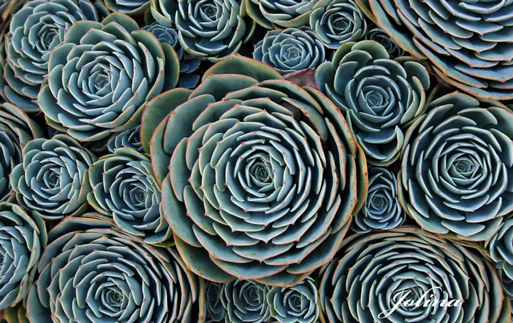]
[[boredpanda]](https://www.boredpanda.com/geometry-symmetry-plants-nature/?utm_source=google&utm_medium=organic&utm_campaign=organic)

---
.header[Introduction]
## Patterns


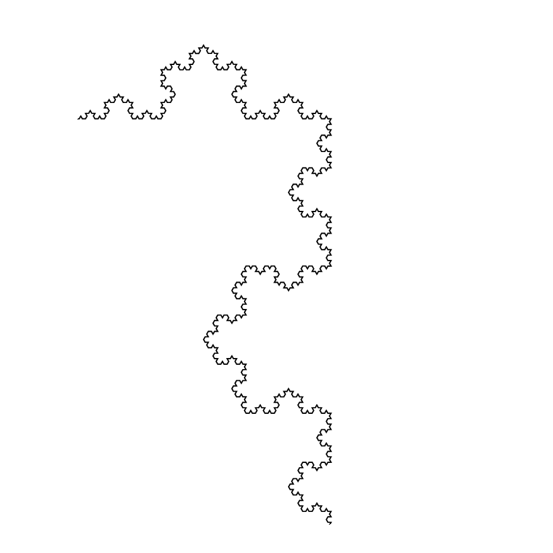  
[[stackexchange]](https://tex.stackexchange.com/questions/404925/animated-koch-snowflake)  

---
.header[Introduction]
## Abstraction

--

  
[[Hilma af Klint, Group V, The Seven-Pointed Star, 1908]](https://medium.com/as-mag/modern-mystic-hilma-af-klint-c4ef6c27467c)  

---
.header[Introduction]
## Abstraction

.center[]
[[Francis Picabia, Quadrato rosso, Kazimir Malevich, 1915]](https://en.wikipedia.org/wiki/File:Francis_Picabia,_1912,_La_Source,_The_Spring,_oil_on_canvas,_249.6_x_249.3_cm,_Museum_of_Modern_Art,_New_York._Exhibited,_1912_Salon_d%27Automne,_Paris.jpg)

---
.header[Introduction]
## Abstraction

.center[]
[[Albert Omoss]](https://omoss.io/)  


---
.header[Introduction]
## Abstraction

.center[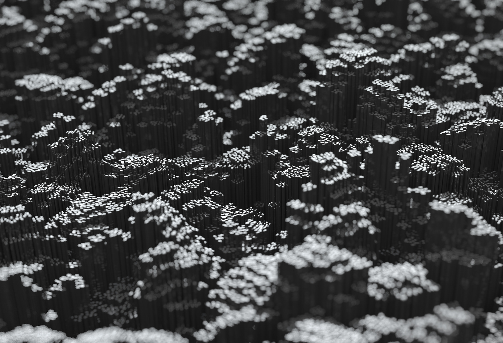]
[[Lee Griggs]](https://leegriggs.com)

---
.header[Introduction]
## Procedural Generation

--

.center[]

---
.header[Introduction]
## Procedural Generation


.center[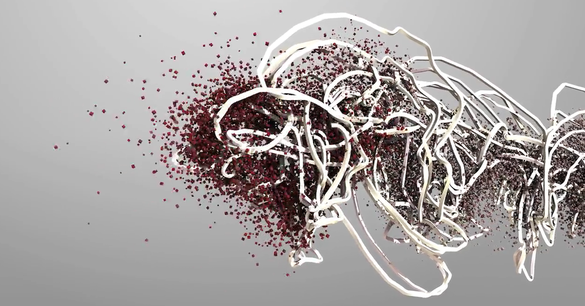]

[Forms by Memo Akten and Quayola](https://vimeo.com/38017188)


???
.task[COMMENT:]  

* Forms is a series of studies on human motion, and its reverberations through space and time. [...] Rather than focusing on observable trajectories, it explores techniques of extrapolation to sculpt abstract forms, visualizing unseen relationships – power, balance, grace and conflict – between the body and its surroundings.
  
* The project investigates athletes; pushing their bodies to their extreme capabilities, their movements shaped by an evolutionary process targeting a winning performance. Traditionally a form of entertainment in todays society with an overpowering competitive edge, the disciplines are deconstructed and interrogated from an exclusively mechanical and aesthetic point of view; concentrating on the invisible forces generated by and influencing the movement.
  
* The source for the study is footage from the Commonwealth Games. The process of transformation from live footage to abstract forms is exposed as part of the interactive multi-screen artwork, to provide insight into the evolution of the specially crafted world in which the athletes were placed.


---
## Unreal

  
[[pcgamesn]](https://www.pcgamesn.com/unreal-engine-5-demo)

--

> Always think about your work as creating a process, rather than a thing.  
  


---
template:inverse

# Beauty in Maths

???
.task[COMMENT:]  

---
## Beauty in Maths

--
* Learn about visual properties of some numbers and curves

--
* Get an intuition on how to use formulas in regard to their design space and their implementation

--
* Learn how to grow leaves like a plant

---
## Beauty in Maths

.center[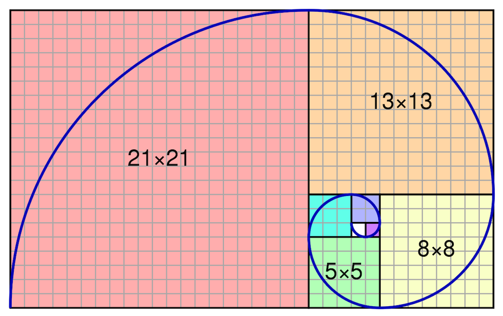[[wiki]](https://commons.wikimedia.org/wiki/File:FibonacciSpiral.svg)]  


???
.task[COMMENT:]  

* The above segmentation of an rectangle approximates the *golden spiral*. 
* We have a *golden* ratio if the ratio of two quantities is the same as the ratio of their sum to the larger of the two quantities.

$\frac{a+b}{a} = \frac{a}{b}$

---
## Beauty in Maths


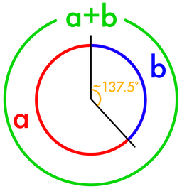  
[[gofiguremath]](http://gofiguremath.org/natures-favorite-math/the-golden-ratio/the-golden-angle/)

  
[[fineartamerica]](https://fineartamerica.com/featured/1-golden-angle-thomas-festerscience-photo-library.html)


???
.task[COMMENT:]  

* 
The best solution to *how far to turn from the last leaf* in degree is therefore $~137.5°$, and that is what all kinds of plants do.

---
## Beauty in Maths


  


???
.task[COMMENT:]  

* Vogel, H (1979). **A better way to construct the sunflower head**. Mathematical Biosciences 44 (44): 179–189.

---
## Beauty in Maths

  


???
.task[COMMENT:]  

* But the fascination doesn't stop here. If we change the angle from the golden angle to an arbitrary angle between 0..360 we get vastly different designs for only very small changes. The following code maps the angle to turn to the mouse position in x. Try the code for yourself!
* Fractions for the `ratio` value lead to spikes, while getting closer to an irrational number produces dense distributions:

---
## Beauty in Maths

  
[[fineartamerica]](https://fineartamerica.com/featured/flow-of-life-flow-of-pi-cristian-ilies-vasile.html)

---
## Beauty in Maths

### The Rose Curve

.center[[[wiki]](https://en.wikipedia.org/wiki/Rose_(mathematics))]  
  
---
## Beauty in Maths

.center[]

---
template:inverse

# Function Design


???
.task[COMMENT:]  

With this chapter, you will

* gain an intuitive understanding of the visual qualities of different operators and function components.
* gain some understanding of how to put the different function components together to create a specific design goal.

---
## Function Design

Gain an understanding of

--

* the visual qualities of different operators and function components

--
* how to put the different function components together to create a specific design goal


---
## Function Design

.center[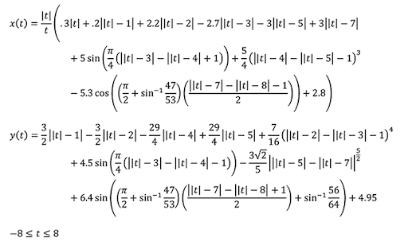[[geogebra]](https://www.geogebra.org/m/Wkjz2X92)]

.center[[[wiki]](https://en.wikipedia.org/wiki/Rose_(mathematics)] 


---
## Function Design

.center[]  

???
.task[COMMENT:]  

* The simplest of transitions is the step function, which switches between values based on a threshold, meaning with a fixed value that *t* is smaller or larger to.


---
## Function Design

.center[

]


???
.task[COMMENT:]  

* Often times we want to repeat certain visual features, which can be done in its simplest form e.g. with a `sin` function. However, there are several other design options. The following functions are also often called *wave functions*.
* Wave functions have as common properties
    * frequency (“*how often*”), and
    * amplitude (“*how much*”).


---
## Function Design


.center[]

---
## Function Design

.center[]  

---
## Function Design


.center[]  
[[Happy Jumping by Iq]](https://www.shadertoy.com/view/3lsSzf)


---
template:inverse

# Tilings

---
## Tilings


--
* Know about the formal world of tilings and be aware of their mathematical complex constructions

--
* Know which terms to investigate if you are further interested in the formal aspects of tilings

--
* Understand the design of Islamic art, its characteristics and approaches to implement them

--
* Learn about contexts and interpretations of geometry

---
## Tilings

.center[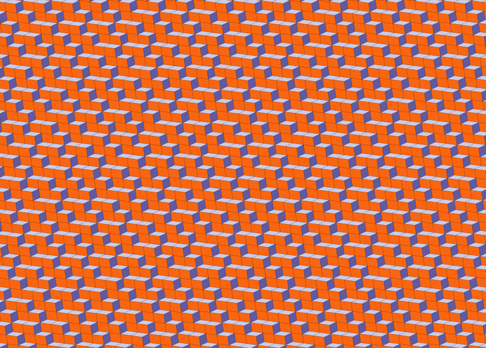]
  
[[encyclopedia of tilings]](https://tilings.math.uni-bielefeld.de/substitution/a-ab--b-c--c-a-dual/) 


???
.task[COMMENT:]  

* Formulas for tilings and mathematical proof on what is possible?
* The dual tiling of the 1D tiling a->ab, b->c, c->a, resp. the version with polygonal tiles.

---
## Tilings

.center[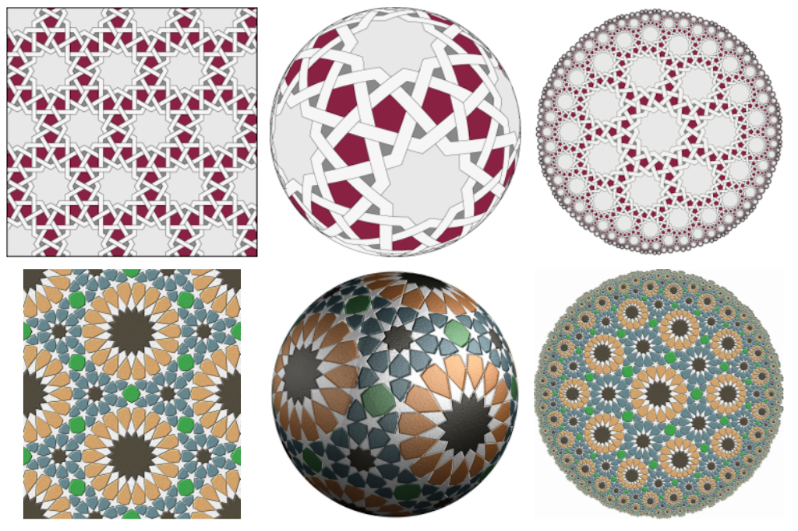]
  
[[Craig S. Kaplan]](http://www.cgl.uwaterloo.ca/csk/projects/starpatterns/)


???
.task[COMMENT:]  

* Computer generated star patterns, inspired by islamic art, applied to the Euclidean plane, the surface of the sphere, and the hyperbolic plane.

---
## Tilings

.center[]

[[ricoflow]](https://www.youtube.com/watch?v=FqBWjJQKICk)

---
## Tilings

.center[]  
[[travelingalchemists]](https://travelingalchemists.wordpress.com/) 


???
.task[COMMENT:]  

* The above image, depicts the *seed of life*, which is believed to be an ancient geometric universal symbol for all creation.
* Speaking of religion, there is a discipline called *sacred geometry*. Sacred geometry ascribes symbolic and sacred meanings to certain geometric shapes and certain geometric proportions. It is associated with the belief that god is a mathematician, specializing in geometry, applying this mastery when building the world. Here, the synchronicity of the universe is determined by certain mathematical constants, which express themselves in the form of patterns and cycles in nature. The geometry used in the design and construction of religious structures such as churches, temples, mosques, religious monuments, altars, and tabernacles has then sometimes been considered sacred. 

---
## Tilings

.center[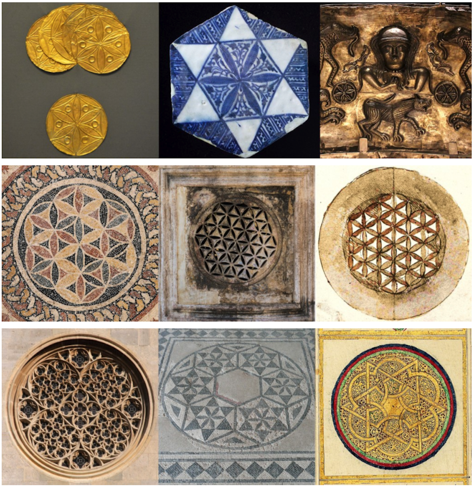]  
[[etemetaphysical]](https://blog.etemetaphysical.com/seedoflife/) 

???
.task[COMMENT:]  

* The above image, depicts the *seed of life*, which is believed to be an ancient geometric universal symbol for all creation.
* Speaking of religion, there is a discipline called *sacred geometry*. Sacred geometry ascribes symbolic and sacred meanings to certain geometric shapes and certain geometric proportions. It is associated with the belief that god is a mathematician, specializing in geometry, applying this mastery when building the world. Here, the synchronicity of the universe is determined by certain mathematical constants, which express themselves in the form of patterns and cycles in nature. The geometry used in the design and construction of religious structures such as churches, temples, mosques, religious monuments, altars, and tabernacles has then sometimes been considered sacred. 


---
## Tilings

.center[]

[[forgingmind]](https://www.forgingmind.com/collections/frontpage/products/bioluminescence)


---
template:inverse

# Noise Functions


---
## Noise Functions

Gain an understanding of 

--
* what a procedural noise function is and the requirements for it

--
* the different types of noise

--
* how to use noise

---
## Noise Functions

.center[]

```js

smooth_pseudo_noise(x) = smooth_saw(x) * step_random(x) 
                         + smooth_saw(x - 1) * (step_random(x - 1) * -1 + 1)
```

--

There is good noise and bad noise.

* Spatial correlation
* No periodicity
* A defined distribution
* Reproducibility


---
## Noise Functions

  
[[Jackson Pollock - Number 14 gray (1948)]](https://thebookofshaders.com/11/)

---
## Noise Functions

  
[[processing]](https://www.processing.org/examples/bouncybubbles.html)


---
## Noise Functions

  
[[iquilezles]](http://www.iquilezles.org/)

---
## Noise Functions

.center[]
[[sidefx]](https://vimeo.com/75313908)

---
## Noise Functions

### Turbulence Noise

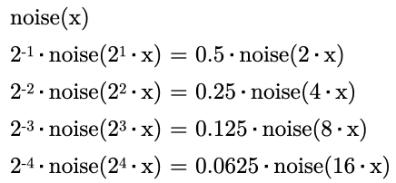  
  


---
## Noise Functions

  
[[Warping by Iq]](https://www.shadertoy.com/view/4s23zz)

---
## Noise Functions

### Cellular Noise

  
[[thebookofshaders]](https://thebookofshaders.com/12/)

--

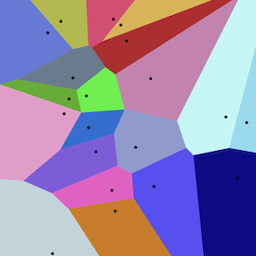  
[[wiki]](https://en.wikipedia.org/wiki/Voronoi_diagram#/media/File:Euclidean_Voronoi_diagram.svg)

---
template:inverse

# Dynamics


---
## Dynamics

--
* an understanding of the different approaches to moving stuff,

--
* an understanding of the theoretical backgrounds of dynamics
    * Calculus
    * Velocity, acceleration, forces, ...
    * Newton’s Laws of Motion
--
* the ability to transfer the theory to examples of dynamic systems in Unreal


---
## Dynamics


???
.task[COMMENT:]  

In short, velocity is a *rate of change*.

Computations in regard to moving objects and changing locations are part of *[Calculus](https://en.wikipedia.org/wiki/Calculus)*, *the study of change*.  

---
## Dynamics

If we want to compute a new location for a point **p** over time t, we apply its velocity **v** and acceleration **a**:

**v'** = **v** + **a** · **Δt**  
**p'** = **p** + **v'** · **Δt**  

* Velocity measures the change in location over a certain time.
* Acceleration measures the change in velocity over time

---
## Dynamics

#### Newton’s Second Law of Motion

> Force equals mass times acceleration, hence **F** = **M** · **A**.  

With **F** as force, **M** as mass and **A** as acceleration.

--


---
## Dynamics

### Example Air and Fluid Resistance

  
[[codingtrain]](https://editor.p5js.org/codingtrain/sketches/5V8nSBOS)  

???
.task[COMMENT:]  

* Friction occurs when a body passes through a liquid or gas. This force is called a *drag force*, or a *viscous force*, or *fluid resistance*. With that we want to model e.g. a drag force for a liquid (the gray area).


---
template:inverse

# Particles

---
## Particles

Gain an understanding of

--
* the components of particles systems

--
* the characteristics for more natural movements with agents

--
* how to transfer the theory to examples of dynamic particle systems Unreal

---
## Particles


---
## Particles

.center[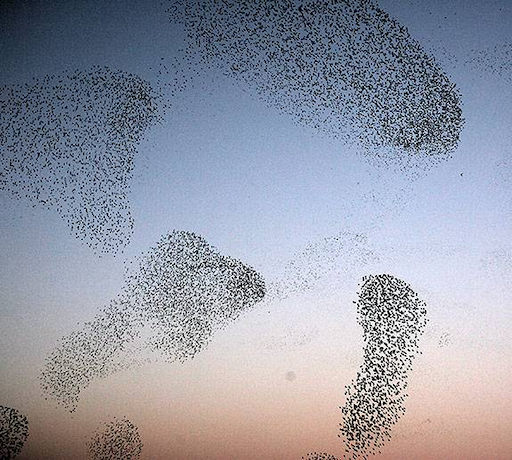]

[[princeton.edu]](https://www.princeton.edu/news/2013/02/07/birds-feather-track-seven-neighbors-flock-together) *Flocks of birds.*, [[pinterest]](https://www.pinterest.de/pin/31243791139408749/) *A school of fish.*

---
.header[Particles]

## Agency

.center[]
[[11]](https://natureofcode.com/book/chapter-6-autonomous-agents/)  

Agency as the desire to move in a certain way.

---
.header[Particles]

## Boids

  
[[codingtrain]](https://editor.p5js.org/codingtrain/sketches/ry4XZ8OkN) 

* Separation  
* Alignment 
* Cohesion 


???
.task[COMMENT:]  

* The left slider adjusts the influence of alignment, the middle one cohesion and the right one separation
* http://www.basis64.nl/flocking3D/

---
template:inverse

# Fluids

---
## Fluids

Gain an understanding of

--
* what a fluid is an its properties

--
* the formal representation of a fluid

--
* a real-time solution for a fluid visualization in the context of VFX


---
## Fluids


.center[]  
[[Created with Wind Tunnel/Quanta Magazine]](https://www.quantamagazine.org/what-makes-the-hardest-equations-in-physics-so-difficult-20180116/)

---
## Fluids


---
template: inverse

# *That's it!*


---
# Next

--

### CTech Workshops

--
* Shader Programming

--
* C++ in Unreal

--
* Materials & Shading

--
* Houdini (?)

### Projects

Does it makes sense for you

--
* ...to have procedural generation in your set of skills? If yes, 
    * with which tool do you want to work with?
    * which outputs / designs / setups are you aiming for?
--
* ...to have Unreal in your set of skills? If yes, 
    * which Unreal topic so you want to look into next?
    * which outputs / designs / setups are you aiming for?


---
template:inverse

# Feedback

---
.header[Feedback]

## Anything Worthwhile to Mention?

* How would you rate the difficulty?
* How would you rate the amount of work?
* What do you think about Unreal as tool to learn for a CTecht student? Is it valuable?
* What do you think about Unreal as a tool for this class? I am fully aware that the Unreal exercises do not yet fully connect to the theoretical topics, try to answer this question also in regard to whether you could imagine that Unreal exercises could potentially fit well to the theory.
* Do you have any other ideas reading which tools to use for this class?
* Do you have any useful hints to pass on to future students?
* What is your opinion regarding practical exercises in class?
* Which one was your favorite chapter, which one your least favorite?
* Was there a topic missing and if so which one?
* Please feel free to add any feedback you want to give!


---
template:inverse

# The End

# 👋🏻

(for real!)
