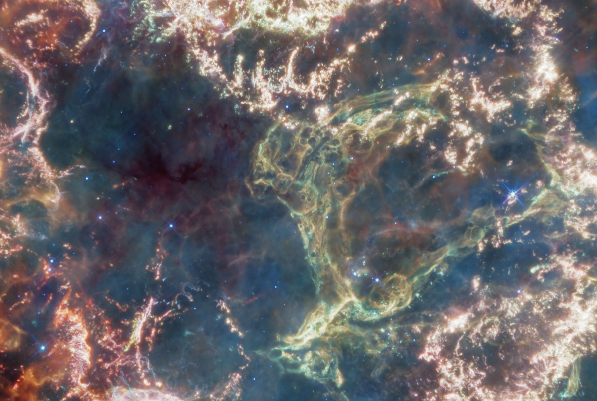

# Procedural Generation and Simulation

Prof. Dr. Lena Gieseke \| l.gieseke@filmuniversitaet.de \  
Teaching Assistant: Sylvia Rybak \| sylvia.rybak@filmuniversitaet.de

---

  
[[Cassiopeia A; 2023, NASA, ESA, CSA]](https://webbtelescope.org/contents/media/images/2023/121/01GWQBBY77MHGFV3M3N63KDCEJ?itemsPerPage=100&page=1&filterUUID=91dfa083-c258-4f9f-bef1-8f40c26f4c97), [[Zoom into the image →]](https://webbtelescope.org/resource-gallery/images/zoomable-cassiopeia-a)

<!-- 
Cassiopeia A (Cas A) is a supernova remnant located about 11,000 light-years from Earth in the constellation Cassiopeia. It spans approximately 10 light-years. This new image uses data from Webb’s Mid-Infrared Instrument (MIRI) to reveal Cas A in a new light.
On the remnant’s exterior, particularly at the top and left, lie curtains of material appearing orange and red due to emission from warm dust. This marks where ejected material from the exploded star is ramming into surrounding circumstellar material. 
Interior to this outer shell lie mottled filaments of bright pink studded with clumps and knots. This represents material from the star itself, and likely shines due to a mix of various heavy elements and dust emission. The stellar material can also be seen as fainter wisps near the cavity’s interior.
A loop represented in green extends across the right side of the central cavity. Its shape and complexity are unexpected and challenging for scientists to understand.
This image combines various filters with the color red assigned to 25.5 microns (F2550W), orange-red to 21 microns (F2100W), orange to 18 microns (F1800W), yellow to 12.8 microns (F1280W), green to 11.3 microns (F1130W), cyan to 10 microns (F1000W), light blue to 7.7 microns (F770W), and blue to 5.6 microns (F560W). The data comes from general observer program 1947
.  
MIRI was contributed by NASA and ESA, with the instrument designed and built by a consortium of nationally funded European Institutes (the MIRI European Consortium) and NASA’s Jet Propulsion Laboratory, in partnership with the University of Arizona.
Zoomable image
IMAGE: NASA, ESA, CSA, Danny Milisavljevic (Purdue University), Tea Temim (Princeton University), Ilse De Looze (UGent)
IMAGE PROCESSING: Joseph DePasquale (STScI) 
 -->

## Syllabus

* [Procedural Generation and Simulation](#procedural-generation-and-simulation)
    * [Syllabus](#syllabus)
    * [Learning Objectives](#learning-objectives)
    * [Time and Place](#time-and-place)
    * [Method of Instruction](#method-of-instruction)
    * [Schedule of Topics](#schedule-of-topics)
    * [Final Exercise](#final-exercise)
    * [Evaluation](#evaluation)
        * [Grading](#grading)
        * [Criteria](#criteria)
    * [Materials](#materials)
        * [Structure](#structure)

This course introduces participants to procedural and simulation algorithms for 2D and 3D graphics. Focus lies on the creation of patterns and abstracted design. Topics are reflected from all sides: their underlying formal theories, their practical implementations as well as their design. Different implementation frameworks can be used, the course focuses on Unreal.

## Learning Objectives

* Overview about techniques and their capabilities
* Understanding of formal theories and algorithms
* Practical implementation experiences
* Implementation of specific design goals

## Time and Place

* Wednesdays, 10.00-13.30, room 6119
    * 9 sessions in total
* 3 SWS, 4 ECTS

## Method of Instruction

The class is conducted as lectures with exercises. Exercises are weekly and biweekly. The attendance of the lectures is not mandatory. However, I do not guarantee that all lecture content is given by the scripts and exercises.

## Schedule of Topics  

| Chapter | Title           | Topic           |
|---------|-----------------|-----------------|
| **1**   | Introduction    | Topics          |
|         |                 | Tools           |
|         |                 | Abstraction     |
| **2**   | Beauty in Maths | Numbers         |
|         |                 | Formulas        |
| **3**   | Pattern         | Function Design |
| **4**   | Tilings         | Islamic Designs |
| **5**   | Noise           | Properties      |
|         |                 | Function        |
|         |                 | Cellular        |
| **6**   | Dynamics        | Forces          |
| **7**   | Agency          | Particles I     |
| **8**   | Complex Systems | Particles II    |
| **9**   |                 | Fluids?         |
|         |                 | Crowds?         |
|         |                 | Explosions?     |

Please note that the chapters and their order are subject to change!

## Final Exercise

* The last exercise is mandatory to pass the class.
* **Less than 16h**, meaning two days of work, are the minimum requirement for the final exercise.
* The project must refer to one of the lecture topics. You must come up with your own task.
* You can also base your project on a tutorial from the internet. The result of the tutorial will not be enough however, you have to develop the project somehow further and make it your own. 
* The (hard) deadline for the final exercise is **July 31st**.

## Evaluation

Weekly exercises result in 10 points, biweekly exercises in 20 points, unless specifically stated otherwise. The final exercise counts for 40 points.

The requirements to pass the course are

* at least 4 completed sessions with at least 70% of the points
* the final exercise, which is an individually chosen task.

There will be a grade. 

### Grading

The grade is computed from the assignment points and the final exercise.
  
You can hand in exercise results up until July 31st to make them count (this is a hard deadline).  
  
If you hand in an exercise after the deadline that is given in a session **15% of the total points will reduced** (e.g. for 10 points 1.5 points are reduced).

### Criteria

As the exercises might be relatively open-ended problems, the grading criteria are based on

* conceptual mastery,
* the amount of work put in,
* engineering effort, code / setup organization, code / setup quality, and
* the (e.g. visual) quality.

Some tasks might have specific grading criteria, which are then indicated per task.

## Materials

* On Wednesday all session materials are published for the following week.
* Exercise results will usually be due on Mondays and we will discuss the results of the assignments the following Wednesday.
* You hand in all materials through GitHub.

### Structure

Materials are structured as follows:

* In [`Sessions`](01_sessions) you find a [folder](01_sessions/01_intro/) with an index for each week (session = week).
    * The [README.md](01_sessions/01_intro/README.md) in each session folder gives you an overview of all the readings, assignments, practical exercises, etc. that you have to do for that week - it is your todo list! I recommend to start your work with going through that file.
* In [`Scripts`](02_scripts) you find all scripts.
* In [`Slides`](03_slides) you find all slides.
* In `assignments` you submit your work each week to the folder with your last name and a folder with the session index. You will submit all assignments to the same folder (the one with your last name).
    * Please do not submit files larger than 25 MB. Upload large in [this Owncloud folder](https://owncloud.gwdg.de/index.php/s/N43JZHuPGtrPS1L). Follow the same folder naming scheme as in Github.

